```mermaid
flowchart TD
    subgraph Triggers["Pull request triggers"]
        PR["opened / synchronize / reopened / ready_for_review"]
    end

    subgraph Changes["compute-changes"]
        Files["changed files"]
        Affected["affected crates + reverse deps"]
        ClippyBins["clippy binpack\nplan-clippy-batches.sh"]
        Backend["backend_changed?"]
        BackendRecipe["backend_recipe_changed?"]
        InferenceArtifact["inference_artifact_required?"]
        WindowsCPU["windows_cpu_build_required?"]
        WindowsGPU["windows_gpu_build_required?"]
        SDK["sdk_smoke_required?"]
        Website["website_changed?"]
        WebsiteDocs["website_docs_changed?"]
        CLIDocs["cli_surface_changed?"]
        Docs["docs_only?"]
    end

    PR --> Files --> Affected
    Affected --> ClippyBins
    Files --> Backend
    Files --> BackendRecipe
    Files --> WindowsCPU
    Files --> WindowsGPU
    BackendRecipe --> Backend
    BackendRecipe --> WindowsCPU
    BackendRecipe --> WindowsGPU
    Affected --> InferenceArtifact
    Backend --> InferenceArtifact
    SDK --> InferenceArtifact
    Affected --> SDK
    Files --> Website
    Files --> WebsiteDocs
    Files --> CLIDocs
    Files --> Docs

    subgraph Quality["pr_quality.yml · PR Quality Checks"]
        direction TB
        Fmt["rust-fmt"]
        Clippy["rust-clippy matrix\nweighted affected-crate bins"]
        UIQ["ui-quality\nReact console"]
        CLIDocsSync["cli-docs-sync\nCLI surface requires public docs"]
        QSummary["summary"]
        Fmt --> QSummary
        Clippy --> QSummary
        UIQ --> QSummary
        CLIDocsSync --> QSummary
    end

    subgraph WebsitePR["pr_website.yml · PR Website Checks"]
        direction TB
        WebsiteBuild["website-build\nEleventy/Tailwind/Pagefind"]
        WebsiteSummary["summary"]
        WebsiteBuild --> WebsiteSummary
    end

    ClippyBins --> Clippy
    Affected --> Fmt
    Files --> UIQ
    Website --> WebsiteBuild
    WebsiteDocs --> CLIDocsSync
    CLIDocs --> CLIDocsSync

subgraph PRCI["pr_builds.yml · PR Builds"]
        direction TB
        subgraph Producers["top-level target jobs"]
            LinuxCPU["linux_cpu_artifact\ndebug mesh-llm · CLI smoke\n→ ci-linux-inference-binaries"]
            LinuxTests["linux_test_groups matrix\nSDK/API · Skippy · unit · protocol · Skippy smoke"]
            LinuxTargets["linux_targets matrix\nCUDA / ROCm / Vulkan rows build when backend_changed"]
            WindowsTargets["windows_targets matrix\nCPU / CUDA / ROCm / Vulkan\nfull builds only for Windows inputs"]
            MacCPU["macos_cpu_artifact\nmacOS Metal build · CLI smoke\n→ ci-macos-inference-binaries"]
            MacTests["macos_unit_tests"]
            MacTargets["macos_targets matrix\nCUDA / ROCm / Vulkan explicit skips"]
        end

        subgraph Smokes["artifact-consuming smokes"]
            Restore["restore-smoke-inputs action\ndownload artifact · stage binary · restore model"]
            Inference["smoke.yml\nLinux inference + OpenAI + split serving"]
            Scripted["scripted-binary-smoke.yml\ntwo-node client/serving"]
            SDKSmoke["sdk-smoke.yml\nnative · Kotlin · Swift"]
        end
    end

    Docs -. "true: gate heavy jobs" .-> PRCI
    InferenceArtifact --> LinuxCPU
    Affected --> LinuxTests
    InferenceArtifact --> MacCPU
    Affected --> MacTests
    Backend --> LinuxTargets
    WindowsCPU --> WindowsTargets
    WindowsGPU --> WindowsTargets
    Backend --> MacTargets
    LinuxCPU -- "artifact: ci-linux-inference-binaries" --> Restore
    MacCPU -- "artifact: ci-macos-inference-binaries" --> Restore
    Restore --> Inference
    Restore --> Scripted
    Restore --> SDKSmoke
    SDK --> SDKSmoke

    subgraph Cleanup["pr_cleanup.yml · PR Cache Cleanup"]
        Closed["pull_request_target closed"]
        PlanCaches["plan cache shards for\nrefs/pull/<PR>/merge"]
        DeleteCaches["matrix delete cache shards\nrepo-var workers · serial per worker"]
        DeleteArtifacts["delete artifacts from\nmatched PR workflow runs"]
        CleanupSummary["cleanup summary"]
        Closed --> PlanCaches --> DeleteCaches
        Closed --> DeleteArtifacts
        DeleteCaches --> CleanupSummary
        DeleteArtifacts --> CleanupSummary
    end

    subgraph MainRelease["non-PR workflows"]
        MainCI["ci.yml\npush main / dispatch"]
        WebsiteDeploy["website-pages.yml\nActions Pages deploy\nPublic Website environment"]
        DockerPublish["docker.yml\ntag / dispatch publish"]
        Release["release.yml\nrelease artifacts + publish gates"]
    end

    style Quality fill:#1a3a5c,stroke:#4a90d9,color:#e8f4fd
    style WebsitePR fill:#1f355c,stroke:#8ab4f8,color:#e8f4fd
    style PRCI fill:#1a3d2e,stroke:#2ecc71,color:#eaffef
    style Producers fill:#1a3d2e,stroke:#2ecc71,color:#eaffef
    style Smokes fill:#17324d,stroke:#4a90d9,color:#e8f4fd
    style Cleanup fill:#3d2b00,stroke:#f39c12,color:#fff8e1
    style MainRelease fill:#2a2a2a,stroke:#888,color:#ddd
```

## Current PR Builds contract

- `pr_quality.yml` is named **PR Quality Checks** and owns the earliest Rust,
  React console, and CLI-documentation feedback: formatting, React console UI
  quality when relevant, the CLI-docs sync guard when Rust CLI definitions
  change, and deterministic clippy bins from
  `scripts/plan-clippy-batches.sh`. Its summary job writes a Markdown table to
  `$GITHUB_STEP_SUMMARY` instead of printing a terminal-only table.
- `pr_website.yml` is named **PR Website Checks** and owns the public website PR
  canary. It uses `.github/actions/compute-changes` and runs
  `website-build` only when `website_changed` is true, or when manually
  dispatched, so public website validation is separate from Rust/React-console
  quality checks while still using the central routing signals.
- `ui_changed` and `website_changed` intentionally describe different products:
  `ui_changed` is only the embedded React console under `crates/mesh-llm-ui/**`,
  while `website_changed` is only the public Eleventy/Tailwind/Pagefind website
  and its passthrough inputs. Website changes do not trigger React console UI
  quality or UI artifact rebuilds.
- CLI surface changes in `crates/mesh-llm-cli/src/{parser,models,runtime,benchmark}.rs`
  set `cli_surface_changed`. When that flag is true, `cli-docs-sync` requires a
  public website docs/example update under `website/src/docs/pages/` or
  `website/src/_includes/`, with `website/src/docs/pages/CLI.md` as the primary
  command reference.
- `pr_builds.yml` is named **PR Builds** and owns PR target jobs plus integration
  and smoke validation. Linux and macOS CPU artifact jobs upload the binaries
  that downstream smoke jobs consume before long validation groups finish;
  Linux test groups run SDK/API, Skippy, unit, protocol, and Skippy smoke work
  as parallel matrix rows. Linux/macOS backend matrices remain separate from the
  CPU artifact producers.
- `rust_changed` is not an artifact-build signal. Rust tooling changes such as
  `tools/xtask/**` still run PR Quality formatting/clippy, but PR Builds only
  builds `mesh-llm` artifacts when `inference_artifact_required` is true: a
  runtime-facing crate, SDK smoke input, React console UI artifact input,
  backend/native input, all-rust fail-open/escalation, or manual dispatch.
- `Justfile` is routed by changed hunks, not by path alone. Website/dev recipe
  edits stay light, while native build, ABI, release, bundle, and package
  recipe edits set `backend_recipe_changed`, which feeds backend artifacts and
  Windows CPU/GPU build eligibility.
- Workflow/orchestration-only PR edits validate the PR routing graph without
  becoming Rust crate changes. They must not fan out into Linux/macOS artifact
  producers, native backend, Windows GPU, benchmark, or SDK-smoke lanes unless a
  changed file also affects Rust crates, React console UI assets, public website
  inputs, SDK inputs, or backend products. Backend lanes are reserved for files
  that can affect native ABI/backend products, such as `third_party/llama.cpp/**`,
  `crates/skippy-ffi/**`, backend build scripts, backend-relevant Justfile
  hunks, and `.github/cache-version.txt`.
- Windows target jobs use compute-changes' `windows_cpu_build_required` and
  `windows_gpu_build_required` outputs for full platform builds. The CPU row can
  still run lightweight Windows cargo checks for broad Rust changes, but
  CUDA/ROCm/Vulkan rows stay skipped unless Windows GPU inputs changed,
  backend-relevant Justfile hunks changed, or the workflow is manually
  dispatched.
- `pr_cleanup.yml` deletes PR merge-ref caches and artifacts from positively
  matched PR workflow runs when a pull request closes. Cache cleanup first plans
  deterministic shards, then fans deletion out across
  `vars.PR_CACHE_CLEANUP_WORKERS` workers (default `5`) while keeping each worker
  serial and rate-limited; a final summary aggregates cache shard results plus
  artifact cleanup. Cleanup-only workflow edits do not fan out into
  Rust/build/smoke jobs.
- Docker image validation and publishing are intentionally not part of pull
  request CI; non-PR workflows (`ci.yml`, `website-pages.yml`, `docker.yml`,
  `release.yml`) own main, dispatch, tag, website deployment, and release-grade
  publishing behavior.

## Public website deployment

- `website-pages.yml` deploys the public static site through GitHub Pages' Actions
  deployment path. It runs on pushes to `main` that change `website/**`, the root
  install scripts that Eleventy copies into the site, or the deploy workflow
  itself, and it can also be run manually with `workflow_dispatch`.
- The deploy workflow cleans generated website output, builds from `website/`
  with `npm ci && npm run build`, stages only the generated public-site paths
  into `public-website-artifact`, and deploys that artifact with
  `actions/deploy-pages` using the custom `Public Website` environment. The
  checked-in `docs/` tree is no longer the Pages source of truth once repository
  Pages settings use the Actions build type.
- Manual `workflow_dispatch` runs are guarded to the `main` ref so the public
  website cannot be deployed from an arbitrary branch by accident.
- Public website deployment stays separate from PR website quality checks:
  `pr_website.yml` proves that website sources build, while `website-pages.yml`
  owns publishing the generated artifact after merge to `main`.

## Artifact and smoke reuse

- Smoke jobs restore binaries through `.github/actions/restore-smoke-inputs` and
  reusable workflows instead of rebuilding `mesh-llm` or patched llama.cpp.
- `restore-smoke-inputs` also owns the single-GGUF smoke model cache used by
  inference, scripted two-node, and SDK smokes. The Skippy CI smoke lanes
  restore a separate two-model cache for dense and recurrent GGUF fixtures, and
  `hf-download-smoke.yml` points the Rust HF integration tests at a cached model
  directory via `MESH_HF_DOWNLOAD_TEST_CACHE_DIR`.
- Shared model caches are restored in PRs and saved only from trusted `main`
  runs.
- Linux CPU artifacts feed inference, two-node, native SDK, and Kotlin SDK
  smokes. macOS CPU artifacts feed Swift SDK smokes.
- Artifact-consuming smokes are additionally gated on the matching CPU producer
  being eligible, so backend-only or cleanup-only PRs skip those jobs natively
  instead of attempting to download an artifact that was never uploaded.
- PR and smoke-only CI artifacts use `retention-days: 1`; PR cleanup removes
  matched PR-run artifacts proactively.
- Direct `mesh-llm` invocations in workflows and CI scripts must include
  `--log-format json`.

## PR CI performance heuristics

Use these checks when reviewing PR CI wall-clock regressions:

- **Critical path minutes**: compare the first job start to the last required job
  finish, then identify the longest required job. Workflow/orchestration-only
  changes should complete after routing validation instead of being dominated by
  Linux/macOS artifacts, Windows, backend, or SDK smoke jobs.
- **Heavy-lane eligibility**: every expensive backend/platform lane should be
  traceable to `backend_changed`, `windows_cpu`, `windows_gpu`, or
  `sdk_smoke_required`. If a workflow/doc-only edit triggers CUDA, ROCm, Vulkan,
  Windows release builds, or Swift/Kotlin SDK smokes, routing is too broad.
- **Duplicate work count**: smoke jobs should consume uploaded Linux/macOS
  binaries through `.github/actions/restore-smoke-inputs`; they should not build
  `mesh-llm` or patched llama.cpp again.
- **Prewarmed ABI cache hit ratio**: Windows ABI cache keys in PR Builds must
  match the trusted `windows-warm-caches.yml` keys. Check
  `gh cache list --branch main --limit 100` for
  `mesh-llm-windows-2025-skippy-abi-*` entries before
  treating a slow Windows miss as expected.
- **Runner routing**: platform-specific work should run on its native runner
  class (Blacksmith Windows 2025 for Windows ABI products, Blacksmith macOS for Swift/Metal, Linux
  for Linux backends) and skip unsupported combinations explicitly.

For agent-facing workflow editing rules, see `.github/AGENTS.md`.
