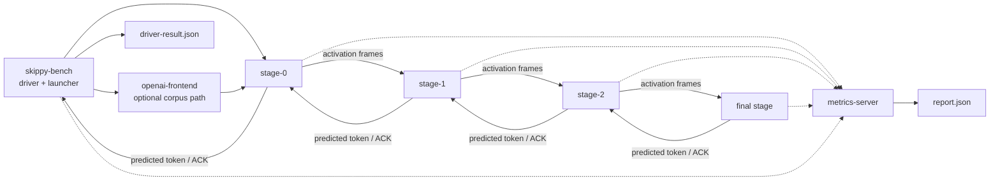

# skippy-bench

Benchmark launcher and local smoke harness.

This crate is for orchestration and performance measurement. Exactness checks
should move toward `skippy-correctness`; existing local split commands
remain useful while the production tool is being promoted.

## Architecture Role

`skippy-bench` launches and measures the same binary stage chain used by mesh.
It can materialize or rsync stage artifacts, start remote stage servers, point
them at `metrics-server`, drive prompt prefill/decode against the first stage,
drive OpenAI corpus requests through the shared frontend, and collect
`driver-result.json` plus `report.json`.



Benchmarks should be read through the staged data path: prompt/control bytes are
small, predicted-token replies are small, and boundary activation frames
dominate transfer volume. Prefill experiments usually focus on layer balance,
chunk size, activation wire dtype, credit settings, and optional async
prefill-forward overlap. Decode is measured too, but current optimization work
should not assume decode is the bottleneck until the report says so.

## Commands

```bash
skippy-bench run --stage-model model-package/ --model-id org/repo:Q4_K_M
skippy-bench run --stage-model model-package/ --cache-type-k q8_0 --cache-type-v q8_0
skippy-bench local-single --model-path model.gguf --model-id org/repo:Q4_K_M
skippy-bench local-split-binary --model-path model.gguf --model-id org/repo:Q4_K_M
skippy-bench local-split-compare --model-path model.gguf --model-id org/repo:Q4_K_M
skippy-bench local-split-chain-binary --model-path model.gguf --model-id org/repo:Q4_K_M
skippy-bench local-split-chain-binary --model-path model.gguf --model-id org/repo:Q4_K_M --splits 8,10,16,20,24,31 --layer-end 32
skippy-bench spd-fixture-parity --manifest skippy-spd-head.json --fixture spd-parity-fixture.safetensors
skippy-bench spd-live-tap-parity --manifest skippy-spd-head.json --fixture spd-parity-fixture.safetensors --model-path model.gguf --splits 8,10,16,20,24,31 --layer-end 32
skippy-bench spd-live-tap-parity --manifest skippy-spd-head.json --fixture spd-parity-fixture.safetensors --model-path model.gguf --splits 8,10,16,20,24,31 --layer-end 32 --verify-steps 8
skippy-bench spd-openai-smoke --stage-server-bin target/release/skippy-server --manifest skippy-spd-head.json --fixture spd-parity-fixture.safetensors --model-path model.gguf --model-id org/repo:Q4_K_M --splits 8,10,16,20,24,31 --layer-end 32 --activation-width 2560 --activation-wire-dtype f16 --max-tokens 8
skippy-bench chat-corpus --base-url http://127.0.0.1:9337/v1 --model org/repo:Q4_K_M --prompt-corpus target/bench-corpora/smoke/corpus.jsonl --max-tokens 64 --stream
skippy-bench token-lengths --model-path model.gguf --prompt-corpus target/bench-corpora/long/corpus.jsonl --ctx-size 8192 --generation-limit 512 --output-tsv target/bench-corpora/long/prompt-lengths.tsv
skippy-bench focused-runtime --schema-smoke --hosts host-a,host-b --splits 1 --layer-end 2
```

Local split smoke commands accept `--selected-backend-device` for diagnostic
runs that need to bypass llama.cpp auto device ordering. Values are the staged
ABI backend names such as `MTL0` or `CPU0`.
`local-split-chain-binary --splits` accepts comma-delimited split boundaries
and launches one binary stage for each range after the in-process first stage.
Use `--stage-bind-base-port` when multiple local chain runs need separate
listener ranges.

`spd-fixture-parity` validates a converted pretrained SPD head against a
Python-exported fixture. It reconstructs `cur_in` from raw hidden-state tap rows
using `g0_proj` and `stage_projs.*`, then runs the Rust Qwen SPD forward path
and reports Python/Rust top-k and max-diff diagnostics. If the fixture includes
cached `spec_past_kv` tensors, the report also includes `cached_forward` with
native `SpdQwen3ForwardCache` top-k parity, cache prefix length, and full-logit
max diff. Use it before wiring a head into live staged serving.

`spd-live-tap-parity` drives the fixture prompt token ids through live Skippy
runtime slices, including an embedding-only side tap for hidden-state index
`0`, assembles the pretrained head input from real activation frames, and runs
the Rust Qwen SPD head from those live taps. It also verifies the live top-1
proposal against a full target Skippy session and compares the committed token
with ordinary greedy decoding. Pass `--verify-steps` to repeat live
tap/head/target-verifier windows over generated context; the recorded
Qwen3.5-4B proof accepted `7 / 8` top-1 proposals and matched ordinary greedy
decoding for every committed token. It is a proof/diagnostic command, not
request-path serving.

`spd-openai-smoke` launches local binary stage processes, starts embedded
stage-0 OpenAI serving, runs a no-SPD baseline request and an SPD request, and
emits one JSON report with response equality, OpenAI decode telemetry, inline
probe events, optimistic-decode events, token downstream waits, tap-return
counts, and tap-record counts. By default it derives
`spd_tap_return_hf_indices` from the SPD manifest topology and strips
hidden-state index `0`, matching the native resolver's selective tap-return
behavior for all logical row roles. Use
this for repeatable request-path smoke evidence before moving to real
multi-node sweeps. Pass `--downstream-wire-delay-ms` and optionally
`--downstream-wire-mbps` to reuse `serve-binary`'s native downstream wire
conditioning for bounded local latency checks before involving lab nodes. Pass
`--spd-top-k 2 --optimistic-min-logit-margin <margin>` to gate optimistic target
decode on the inline SPD head's top-1/top-2 logit margin; the report includes
probe and optimistic-decode margins for calibration. Whenever optimistic SPD
decode starts, the request asks for SPD tap returns so accepted optimistic work
can feed later rolling rows; the margin only controls whether that optimistic
work is started. A pre-patch no-tap diagnostic was faster but starved later
rolling rows, so it is not the current request-path behavior. Pass
`--prompt-file` to run the same baseline/SPD shape over a prompt set. Prompt
files accept non-empty plain-text lines, JSON string lines, JSON objects with
`prompt`, `text`, or `content`, chat-style `messages`, or `turns` arrays.
`messages` are sent to `/v1/chat/completions` unchanged; `turns` are joined
into one user message. `--prompt-limit` bounds quick sweeps. By default
`spd-openai-smoke` sends `chat_template_kwargs.enable_thinking=false`, matching
the Qwen parity fixture exporter and reference SPD eval setup. Pass
`--enable-thinking true` to measure thinking-mode prompts explicitly. Pass
`--warmup-count N --repeat-count M` for isolated warmup and measured case
iterations. Warmup cases remain in `cases[]` with `warmup=true`, but the
aggregate `summary` and paired baseline/SPD comparisons use measured repeats
only. Each iteration launches isolated stage processes so request logs stay
unambiguous while SPD telemetry is still evolving. The report can also exercise
the slow correctness-only replay source with
`--spd-replay-fallback`; combine that with `--optimistic-decode false` when the
goal is to force primary SPD `VerifySpan` windows instead of inline optimistic
probes. The report
includes an aggregate `summary` with paired content matches, mean baseline/SPD
wall and decode time, speedup ratios, total accept/reject counts, optimistic
commit counts, chained optimistic commit counts, tap failures, per-prompt
comparisons, and `summary.pipeline_gap`.
The pipeline-gap block rolls up pre-target, optimistic-commit, and post-target
inline probes, empty post-target probe rate, probe and wait-after-probe timing,
normal versus optimistic downstream wait time, and whether optimistic verifies
requested reusable SPD tap returns. Optimistic-commit probe counts show whether
the sidecar produced an accepted next-token proposal while the already-started
optimistic verifier was still in flight. It also reports pre-target proposals
without tap returns, accepted/rejected tap-return requests, and the tap-return
acceptance rate for optimistic scheduling and margin-gate tuning. The summary
also includes `tap_ignored`, the count of stage-0 inline taps dropped by the
accepted-context lifecycle filter. If both baseline and SPD are run,
`spd-openai-smoke` writes and prints the report, then exits nonzero when paired
baseline/SPD content differs. Pass `--allow-content-mismatch` only for
exploratory sweeps where mismatched output is expected.
Inline probe reports include `cache_used` and `cache_prefix_len` when the
server ran the stateful SPD sidecar cache path for that proposal. They also
include `tap_source`, `tap_collect_ms`, `cur_in_ms`, `forward_ms`,
`cache_prefill_ms`, `head_fixed_stage_projection_ms`, `head_decoder_ms`,
`head_decoder_layer_ms`, `head_final_norm_ms`, `head_lm_head_topk_ms`, and
`head_total_ms` so optimistic probe diagnostics can show whether a proposal came
from inline direct-return taps or slow replay fallback, and whether the current
cost is in cache prefill, sidecar decoder layers, or LM-head/top-k.
`cases[].optimistic_decodes[]` carries `chain=true` for bounded chained
optimistic `VerifySpan` work, and `cases[].token_events[]` preserves the same
chain flag on emitted `DecodeEmbdOptimistic` token events when stage 0 reports
it. Primary `VerifySpan` commits also emit `token_events[]` entries with
`message_kind="VerifySpan"` so rolling replay can reconstruct mixed
primary/optimistic target streams. Chained counters currently prove bounded
one-step target execution; they do not imply the full paper rolling executor is
running. Direct-return prediction replies are origin-tagged on opt-in streams,
so overlapping same-kind final replies can be buffered and matched to the
specific `VerifySpan` that launched them. The origin includes
`checkpoint_generation`, and the serving runtime now keeps checkpoints by
session plus generation so speculative verifier restores cannot overwrite each
other when several target positions are in flight. The report also includes
`summary.max_optimistic_chain_depth` plus per-event `chain_depth` fields on
`optimistic_decodes[]` and `token_events[]`, so deeper rolling queue entries are
visible without reading raw stage logs. `cases[].optimistic_decodes[]` also
reports `hidden_wait_ms`, derived as
`elapsed_ms - start_elapsed_ms - wait_ms`, and `summary.pipeline_gap` rolls that
up as `optimistic_decode_hidden_wait_ms` plus
`chained_optimistic_decode_hidden_wait_ms`. A positive hidden-wait value means a
speculative verifier spent that time in flight behind earlier target work, which
is useful evidence that the queue is overlapping latency even when proposal
quality or restores still prevent an end-to-end speedup.
`cases[].decode.rolling` and `cases[].inline_probes[].rolling` expose the live
request-path rolling scheduler state, including inserted drafts, missing
proposal positions, out-of-order proposals, verified windows, pipeline length,
and verified frontier.
When the runtime observer can form paper-shaped speculation input rows, the
rolling block also includes `row_positions`, resolved inference `row_i_stages`,
`row_evicted_prefix_position`, `row_newest_position`, and
`row_next_draft_position`. Empty row arrays mean no row snapshot was available
for that event, not that the whole request lacked paper-shaped rows. The
scheduler owns nominal paper layout roles; the server resolves those roles
through the sidecar manifest before reporting the row stages used for proposal
assembly.
`cases[].inline_probes[].rolling_verified_delta` is present when the live
observer advances the target-verified prefix and carries the newly verified
start position, verified-up-to frontier, token ids, and token count.
`cases[].decode.spd_proposal_total_*` reports the final SPD proposal-source
totals from stage 0 across primary proposal windows and inline probe attempts:
requested/attempted/proposed counts, inline-tap hits, replay fallbacks, cache
hits/misses, and milliseconds spent collecting taps, assembling `cur_in`, and
running the sidecar head. The same aggregate family includes sidecar cache
prefill, fixed-projection, decoder, final-norm, LM-head/top-k, and total head
timing. Use these fields to identify whether a smoke is exercising
direct-return hidden taps or falling back to slow local replay, and to separate
paper-mechanism correctness from current native serving overhead.
For distinct-device smoke runs, pass `--stage-hosts local,<worker>` to cycle
physical stage placement while keeping stage 0, the OpenAI frontend, and the
SPD sidecar on the coordinator. Use `--endpoint-host-map` to put
remote-reachable endpoint hosts into the generated topology, and use
`--remote-model-path-map` when the worker already has the GGUF staged. The
`--rsync-model-artifacts` option is convenient for small artifacts but can be
too slow for multi-GB GGUFs; stage large model files once and point the smoke at
that path when possible.
Pass `--preflight-only` before a first real-node run to validate the local
model, sidecar manifest, serving checkpoint, parity fixture, tap coverage,
physical stage ranges, remote endpoint map, and remote model path map without
launching stages. The preflight report exits before process startup, rejects
splits that do not expose every requested SPD tap, requires a remote-reachable
stage-0 endpoint when any downstream stage is remote, and emits the exact stage
endpoint/model-path plan that the smoke would use.
`logical_spd_stage_count` records the manifest topology used by the sidecar
head. `summary.paper_pipeline_estimate` projects the observed accept rate onto
the paper/reference rolling pipeline schedule using that logical SPD stage count
and baseline decode cost, while also reporting the physical tap-aligned stage
count. `summary.rolling_trace_replay` replays observed pre-target proposals
and diagnostic `optimistic_commit` proposals through `SpdRollingObserver` to
show whether proposal order would keep the paper pipeline filled or stall on
missing/out-of-order positions. The replay mirrors the server's accepted-context
catch-up after rejected or missing proposal positions. It reports inserted
drafts, first missing proposal position, out-of-order proposals,
verified/rejected windows, final scheduler position, and the final
target-verified prefix tokens. Reports without per-token events still fall back
to final `cases[].decode.rolling` telemetry and increment
`live_cases_observed` instead of `cases_replayed`. Use
`verified_prefix_matches_target` and
`first_verified_prefix_mismatch_position` as the exactness guard for future
scheduler-driven serving changes when a replayed trace is present. The report
uses `skippy-runtime::spd::SpdRollingTraceReplay`, which uses the same observer
path as server diagnostics, so benchmark summaries and future server execution
share the same token/position scheduler contract. Use
these fields to distinguish "the head can propose" from "the staged request
path is actually keeping useful speculative work in flight." Replay is
conservative: if a target token position was not observed, it reports the gap
instead of fabricating a token for the verified prefix.

The old standalone `kv-stage-integration` and `kv-hit-regression` commands are
intentionally absent. Mesh does not carry the legacy standalone cache sidecar
path; exact cache work should be reintroduced through the embedded runtime and
mesh-owned lifecycle.

Benchmark reports carry `model_identity` beside the public `model_id`. The
public id is a coordinate such as `org/repo:Q4_K_M`; when the model path comes
from the Hugging Face cache, that resolved identity is used for stage configs
and reports, including repo, revision, source file, canonical ref, distribution
id, and selector. Arbitrary local paths are treated as artifact locations, not
as identity, so pass `--model-id` for those runs.

`run` and `local-single` accept `--cache-type-k` and `--cache-type-v`, defaulting
to `f16`. These are written into generated stage configs so benchmark reports
can compare baseline K/V cache storage against runtime-supported package candidates
such as `q8_0`. The experimental TCQ/TurboQuant lane is intentionally not
compiled into mesh-llm.

## Benchmark Corpora

Benchmark corpora are generated from Hugging Face datasets instead of checked
into the repository. The checked-in source manifest lives at
`corpora/bench_corpus_sources.json`; generated corpora and downloaded parquet
artifacts live under `target/`.

```bash
just bench-corpus smoke
just bench-corpus long
just bench-corpus coding-loop
just bench-corpus long-context
```

The generator uses the Hugging Face CLI to resolve dataset revisions and
download parquet artifacts, then samples the cached parquet files locally with
DuckDB. If DuckDB is not installed in the active Python, the script falls back
to `uv run --with duckdb`.

Generated layout:

```text
target/bench-corpora/smoke/corpus.jsonl
target/bench-corpora/smoke/manifest.json
target/bench-corpora/long/corpus.jsonl
target/bench-corpora/long/manifest.json
target/bench-corpora/long-context/corpus.jsonl
target/bench-corpora/long-context/manifest.json
target/hf-datasets/<dataset>/<resolved-revision>/...
```

Each corpus row uses a shared schema so all benchmark tools can consume it:

```json
{
  "id": "commitpackft-python:train:00000",
  "tier": "smoke",
  "family": "coding_edit",
  "source": "bigcode/commitpackft",
  "source_config": "python",
  "source_revision": "fc56fe33c030c6daa414c2b112c932b8eed085e6",
  "split": "train",
  "session_group": "commitpackft:repo-or-file",
  "prompt": "...",
  "expected_output": null,
  "metadata": {
    "routing_hint": "ngram",
    "adapter": "commitpack_edit"
  }
}
```

`smoke` is a small HF-sourced plumbing check. `long` uses the same sources and
schema with larger quotas for broad performance and routing comparisons. The
`coding-loop` tier is a warm-session speculative decoding corpus built from
native `SWE-bench/SWE-smith-trajectories` agent trajectories on Hugging Face. It
preserves adjacent turns from the same software-engineering session so n-gram
pooling can be measured on repeated coding edits instead of isolated prompts.
The `long-context` tier keeps a much larger prompt character budget and expands
sampled HF text into long stress packets. It is for 32k context capacity and
transport stress only; do not substitute it for the 8k customer-readiness
baseline or quality/speculation decisions.
The manifest records source datasets, resolved revisions, downloaded parquet
files, quotas, generated row counts, seed, generator path, and generator git
commit.

After generating a corpus, use `token-lengths` with the actual target GGUF to
produce the M1 token audit artifacts. The command applies the model chat
template before tokenization, matching the chat-completions product path:

```bash
skippy-bench token-lengths \
  --model-path /path/to/qwen3.6.gguf \
  --prompt-corpus target/bench-corpora/long/corpus.jsonl \
  --ctx-size 8192 \
  --generation-limit 512 \
  --enable-thinking false \
  --output-tsv target/bench-corpora/long/prompt-lengths.tsv \
  --summary-json target/bench-corpora/long/prompt-lengths-summary.json
```

For the 32k stress lane, run the same audit against
`target/bench-corpora/long-context/corpus.jsonl` with
`--ctx-size 32768`. The summary must show zero `exceeds_context` rows before
the corpus is promoted for that lane.

Speculative target/draft checks can use the generated corpus directly:

```bash
just bench-corpus smoke
target/debug/llama-spec-bench \
  --target-model-path /path/to/target.gguf \
  --draft-model-path /path/to/draft.gguf \
  --prompt-corpus target/bench-corpora/smoke/corpus.jsonl
```

`chat-corpus` drives `/v1/chat/completions` through an existing
chat-completions frontend such as `skippy-server serve-openai`. Use it for
customer-facing benchmark numbers after the stage topology is already running:

```bash
skippy-bench chat-corpus \
  --base-url http://127.0.0.1:9337/v1 \
  --model org/repo:Q4_K_M \
  --prompt-corpus target/bench-corpora/long/corpus.jsonl \
  --max-tokens 512 \
  --concurrency-depth 1 \
  --stream \
  --include-usage true \
  --enable-thinking false \
  --output /Volumes/External/skippy-runtime-bench/qwen36-lab/run/chat-corpus.json
```

The runner preserves chat-style `messages` rows when present and otherwise
wraps `prompt` rows as one user message. If a row contains `session_group` or
`session_id`, that value is sent as the OpenAI `user` field so warm-session
benchmarks can exercise per-session KV or n-gram history. It records
per-request elapsed time, streaming TTFT when `--stream` is enabled, usage
tokens when the frontend returns them, API error codes, and aggregate
latency/token-rate summaries.
Use `--concurrency-depth` for depth sweeps; the effective frontend generation
limit, such as `serve-openai --generation-concurrency`, must still be recorded
beside the result.

`run` is the promoted benchmark launcher. Pass the lab host list explicitly,
for example `--hosts 192.168.0.2,192.168.0.4,black.local`.
The host list must contain one unique host per planned stage; duplicate host
assignments are rejected so every staged run uses separate machines.
Local working files default to `/Volumes/External/skippy-runtime-bench`.
With `--execute-remote`, stage 0 is launched as a local child of the coordinator
while later stages are launched over SSH. This keeps the first-stage process on
the same routing and GPU path as the OpenAI frontend and avoids SSHing back into
the launcher host.

Distributed lab runs must also keep stage layer counts evenly balanced. The
launcher rejects splits where the largest and smallest stage differ by more than
one layer. For Qwen3.6's 40-layer package on three hosts, use
`--splits 14,27`; uneven splits are only for local investigation and should
not be reported as lab benchmark results.

Performance runs default to `--n-gpu-layers=-1`, and lab commands should pass
that flag explicitly so each stage asks llama.cpp to offload all available
layers for its slice. CPU-only runs should be named and treated as diagnostic
baselines, not production performance numbers.

By default it creates a metrics-server run, writes a deployment plan and stage
configs, finalizes the run, and fetches `report.json` without starting remote
processes. Add `--execute-remote` to rsync configs/binaries and start
`skippy-server serve-binary` over SSH. Add `--rsync-model-artifacts` to
copy model artifacts for each stage. For `layer-package`, the coordinator
materializes each stage GGUF locally under `--work-dir/model-cache`, reuses it
when the cached file is newer than the selected package parts, then shells out
to `rsync -az` to place the concrete stage GGUF under each host's stable
`model-cache` path. Remote configs load those files as `artifact-slice`, so
workers do not need temporary space for both the package parts and the composed
GGUF. Use `--remote-root-map host=/path` for
hosts with alternate scratch volumes, for example
`--remote-root-map build.local=/Users/jdumay/models/skippy-runtime-bench`.
When that remote root is the same filesystem visible on the coordinator, add
`--remote-shared-root-map host=/local/path` so the launcher can place the stage
GGUF locally and skip rsync for that file. Use `--endpoint-host-map host=addr`
to force binary stage endpoints onto the intended lab fabric, such as the
private `192.168.0.x` network, instead of mDNS-selected addresses.
For remote runs, pass a remote-reachable collector URL with
`--metrics-otlp-grpc-url`, for example `http://studio54.local:14317`.

Remote runs poll each stage until the PID is alive and the stage log shows the
binary listener; stage 0 is checked locally and remote stages are checked over
SSH. The launcher then connects to the first stage with the binary protocol so
readiness proves the downstream chain can handshake transitively. The measured
prompt driver sends prefill/decode frames to the first stage and writes
`driver-result.json` next to the deployment plan. Use `--prompt` when a
local full model or local layer package is available for llama-backed
tokenization, or `--prompt-token-ids` to provide explicit token IDs. Use
`--prompt-corpus corpus.jsonl` to run a JSONL corpus in one deployment; rows may
contain `prompt`, `turns`, or chat-style `messages`. `--prompt-limit` can
scope a corpus run while preserving the same launch path. Corpus driver output
includes aggregate elapsed, wire elapsed, prefill, TTFT, and decode P50/P95/P99
values in `driver-result.json`. Stage telemetry defaults to
`--stage-telemetry-level summary`, which emits one aggregate request summary per
stage connection. Use `--stage-telemetry-level debug` only when debugging
protocol timing; debug mode emits per-message timing spans for stage compute,
downstream forwarding/wait, upstream reply, and activation byte counts. Use
`--stage-telemetry-level off` for collector-isolation checks.
Use `--prefill-chunk-size` to split prompt prefill into multiple binary
prefill frames without changing decode behavior. Add
`--prefill-chunk-threshold` to keep shorter prompts as a single prefill frame
while still chunking longer prompts. Use `--stage-max-inflight` and
`--stage-reply-credit-limit` to sweep prefill ACK deferral/credit behavior on
the binary stage servers. Debug timing spans include the configured prefill
credit limit, pending deferred replies before/after the message, and credit
wait counts.
Use `--stage-async-prefill-forward` to pass `--async-prefill-forward` to each
binary stage server. This moves eligible non-final prefill activation writes to
a bounded background writer and should be treated as an opt-in transport
experiment until the current topology has been benchmarked.
Use `--prefill-chunk-schedule MIN:SIZE[,MIN:SIZE...]` for experimental
prompt-length schedules. The base `--prefill-chunk-size` applies unless the
prefill token count is at least `MIN`, in which case the largest matching
minimum selects the override chunk size. For example,
`--prefill-chunk-size 256 --prefill-chunk-schedule 513:512` uses 256-token
chunks up to 512 prefill tokens and 512-token chunks above that.
Use `--stage-telemetry-queue-capacity` to size each stage server's bounded
non-blocking telemetry queue for large debug corpus runs. Stage telemetry is
batched and retried from an in-memory replay buffer, but it remains best-effort:
if the queue or retry buffer is exhausted, stage execution continues and the
report surfaces the loss counters.

`focused-runtime` is a thin preset/wrapper around `run` for comparing the staged
runtime's cold-start, first-token, steady-decode, and KV-warm-reuse scenarios
with a compact JSON schema. Real performance runs require `--execute-remote` so
the prompt driver produces timing fields; the wrapper reuses the same deployment
plan, launcher, `report.json`, and `driver-result.json` produced by `run`, then
writes `focused-runtime-report.json` next to them unless `--focused-output` is
set. `--focused-output` also still prints the JSON to stdout.

The scenario presets only change safe driver inputs before delegating to `run`:
`cold-startup` and `first-token` default to one prompt, `steady-decode` defaults
to one prompt with a larger decode budget when `--max-new-tokens` is otherwise
left at the CLI default, and `kv-warm-reuse` defaults to two identical prompts so
the second request can exercise warm-prefix reuse where the model family and
runtime path support it. The report records startup readiness separately from
full run wall time, then mirrors the existing prompt-driver P50/P95 latency,
token-count, and throughput fields under compact top-level `topology`, `model`,
`latency_ms`, `throughput_tokens_per_second`, and `token_counts` objects.

For CI or command-shape validation without a GGUF or remote hosts, use the
schema smoke mode:

```bash
target/debug/skippy-bench focused-runtime \
  --schema-smoke \
  --scenario first-token \
  --hosts host-a,host-b \
  --splits 1 \
  --layer-end 2
```

The smoke output contains the same top-level fields as a real focused runtime
report: scenario, topology/model identity, stage hosts, prompt/decode token
counts, P50/P95 elapsed and TTFT values, decode latency, token throughput, and
paths to the underlying artifacts.

Logs are collected into the local run directory. Remote wrapper processes write
`stage.exit` files when they crash or are terminated, and
`remote-status.json` records the observed exit code. Remote PIDs are terminated
at the end unless `--keep-remote` is set. With `--keep-remote`, the launcher
keeps the local SSH wrapper processes alive after the benchmark command returns
so remote stage servers remain foreground children of their SSH sessions instead
of becoming orphaned background processes. This matters on macOS LAN labs where
orphaned processes can lose private-LAN routing privileges.
