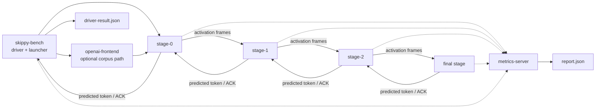

# skippy-bench

Benchmark launcher and local smoke harness.

This crate is for orchestration and performance measurement. Exactness checks
should move toward `skippy-correctness`; existing local split commands
remain useful while the production tool is being promoted.

## Architecture Role

`skippy-bench` launches and measures the same binary stage chain used by mesh.
It can materialize or rsync stage artifacts, start remote stage servers, point
them at `metrics-server`, drive prompt prefill/decode against the first stage,
drive OpenAI corpus requests through the shared frontend, and collect
`driver-result.json` plus `report.json`.



Benchmarks should be read through the staged data path: prompt/control bytes are
small, predicted-token replies are small, and boundary activation frames
dominate transfer volume. Prefill experiments usually focus on layer balance,
chunk size, activation wire dtype, credit settings, and optional async
prefill-forward overlap. Decode is measured too, but current optimization work
should not assume decode is the bottleneck until the report says so.

## Commands

```bash
skippy-bench run --stage-model model-package/ --model-id org/repo:Q4_K_M
skippy-bench run --stage-model model-package/ --cache-type-k q8_0 --cache-type-v q8_0
skippy-bench local-single --model-path model.gguf --model-id org/repo:Q4_K_M
skippy-bench local-split-binary --model-path model.gguf --model-id org/repo:Q4_K_M
skippy-bench local-split-compare --model-path model.gguf --model-id org/repo:Q4_K_M
skippy-bench local-split-chain-binary --model-path model.gguf --model-id org/repo:Q4_K_M
skippy-bench chat-corpus --base-url http://127.0.0.1:9337/v1 --model org/repo:Q4_K_M --metrics-http http://127.0.0.1:18080 --metrics-run-id run-local-qwen --prompt-corpus target/bench-corpora/smoke/corpus.jsonl --max-tokens 64 --stream
skippy-bench token-lengths --model-path model.gguf --prompt-corpus target/bench-corpora/long/corpus.jsonl --ctx-size 8192 --generation-limit 512 --output-tsv target/bench-corpora/long/prompt-lengths.tsv
skippy-bench focused-runtime --schema-smoke --hosts host-a,host-b --splits 1 --layer-end 2
skippy-bench eval list
skippy-bench eval sync --pack core
skippy-bench eval run speed-bench --base-url http://127.0.0.1:9337/v1 --model org/repo:Q4_K_M --metrics-http http://127.0.0.1:18080 --metrics-run-id run-local-qwen
```

Benchmark-managed Skippy server runs require a release `skippy-server` binary.
Run `just release-build` before `run`, `focused-runtime`, `local-single`, or
local split binary benchmarks. These commands default to
`target/release/skippy-server` and reject `target/debug/skippy-server` because
debug builds distort throughput and timeout behavior.

The old standalone `kv-stage-integration` and `kv-hit-regression` commands are
intentionally absent. Mesh does not carry the legacy standalone cache sidecar
path; exact cache work should be reintroduced through the embedded runtime and
mesh-owned lifecycle.

Every reportable benchmark path must use metrics-server. `run`, `focused-runtime`,
and `local-single` launch their own collector by default through
`--metrics-server-bin`, `--metrics-http-addr`, and `--metrics-otlp-grpc-addr`.
Endpoint-driving benchmarks (`chat-corpus` and `eval run`) require an existing
metrics-server at `--metrics-http` and fail before running traffic if the run
cannot be created. For correlated server-side TTFT/FTTT, launch the target
Skippy/OpenAI endpoint so it exports OTLP to that collector with the same
`--metrics-run-id`.

```bash
target/debug/metrics-server serve \
  --db /tmp/skippy-bench-metrics.duckdb \
  --http-addr 127.0.0.1:18080 \
  --otlp-grpc-addr 127.0.0.1:14317
```

Benchmark reports carry `model_identity` beside the public `model_id`. The
public id is a coordinate such as `org/repo:Q4_K_M`; when the model path comes
from the Hugging Face cache, that resolved identity is used for stage configs
and reports, including repo, revision, source file, canonical ref, distribution
id, and selector. Arbitrary local paths are treated as artifact locations, not
as identity, so pass `--model-id` for those runs.

`run` and `local-single` accept `--cache-type-k` and `--cache-type-v`, defaulting
to `f16`. These are written into generated stage configs so benchmark reports
can compare baseline K/V cache storage against runtime-supported package candidates
such as `q8_0`. The experimental TCQ/TurboQuant lane is intentionally not
compiled into mesh-llm.

## External Agent Evals

`skippy-bench eval` manages external benchmark harnesses and points them at an
already-running OpenAI-compatible Skippy or mesh endpoint. External evals are
for agent/coding benchmark claims; the local corpora below remain runtime,
cache, routing, and transport stress traffic.

The current core pack is:

| Eval id | External harness | Default run |
|---|---|---|
| `speed-bench` | llama.cpp `tools/server/bench/speed-bench` | Native SPEED-Bench qualitative run across all categories, no sample limit, `--osl 1024` |
| `terminal-bench` | Terminal-Bench CLI (`tb`) | `terminal-bench-core==0.1.1`, Terminus agent, no task-id filter |
| `swe-bench-pro` | Scale SWE-Bench Pro OS repo | Upstream SWE-agent patch generation, patch gathering, and `swe_bench_pro_eval.py` |
| `mcp-atlas` | Scale MCP-Atlas repo | Native MCP-Atlas completion script with upstream `--no-filter`, plus scoring through auto-started MCP services |

```bash
skippy-bench eval list
skippy-bench eval info terminal-bench
skippy-bench eval sync --pack core
skippy-bench eval doctor
skippy-bench eval run terminal-bench \
  --base-url http://127.0.0.1:9337/v1 \
  --model org/repo:Q4_K_M \
  --metrics-http http://127.0.0.1:18080 \
  --metrics-run-id run-local-qwen
```

`--timeout-secs` is forwarded to native harnesses as their request/task timeout
where supported. It is not a SkippyBench dataset limit and does not cap full
canonical runs. Use `--harness-timeout-secs` only when an operator wants a hard
wall-clock cap around the native harness process for debugging or CI guardrails.
`--endpoint-concurrency` declares the target OpenAI endpoint's generation
concurrency and defaults to `1`. SkippyBench keeps each external harness's LLM
request concurrency equal to that value. If an adapter-specific request
concurrency override such as `SWE_BENCH_PRO_NUM_WORKERS` or
`MCP_ATLAS_COMPLETION_CONCURRENCY` is set to a different value, `eval run`
fails before launching the native harness.

`sync` clones or installs the external harnesses into
`~/.cache/mesh-llm/skippy-bench/harnesses/` by default. Use `--cache-root` to
override that location. Use `--dry-run` with `sync` or `run` to inspect the
commands without cloning, pulling Docker images, or launching a benchmark.
Before launching native harness traffic, `eval run` enforces the same required
tool checks as `eval doctor`, including Docker container-start readiness for
Docker-backed evals.
Terminal-Bench is installed through `uv tool install --python 3.12` because the
current `tb` CLI is not compatible with Python 3.14. `eval doctor` checks that
Docker's daemon is reachable and can start a tiny container, not just that the
`docker` CLI exists or that `docker info` returns.
MCP-Atlas starts its Docker agent environment and Python completion service
when ports `1984` and `3000` are not already reachable, waits for readiness,
and cleans up only the services that the run started. The adapter runs the
upstream completion script with `--no-filter` so all Hugging Face dataset rows
are attempted, and without Skippy-specific task limits or `tool_choice`
overrides. By default, the MCP-Atlas scorer uses the same local
OpenAI-compatible endpoint/model as the completion run; set `EVAL_LLM_MODEL`,
`EVAL_LLM_BASE_URL`, and `EVAL_LLM_API_KEY` to use a separate judge model. For
small local Skippy validation models, keep the completion endpoint in normal
compatibility mode and point the scorer override at a strict structured-output
endpoint, for example a second `skippy-server serve-openai
--openai-guardrails enforce` process. The adapter still uses the native scorer
and does not rewrite score data. For operator resumes, set
`MCP_ATLAS_COMPLETION_OUTPUT_NAME` to an existing upstream
`completion_results/*.csv` basename so the native completion script can reuse
its own resume behavior, and set `MCP_ATLAS_SCORE_CONCURRENCY` to the upstream
scorer's `--concurrency` value.
SWE-Bench Pro defaults to the official Docker image namespace (`jefzda`) with
local Docker deployment and local Docker evaluation so the core pack can run
without Modal credentials. The adapter first runs upstream
`helper_code/generate_sweagent_instances.py` for the full dataset, then feeds
SWE-agent a native `expert_file` instance file so local Docker can set the
official image platform, clear image entrypoints, and use SWE-agent's
standalone Python/SWE-Rex Docker runtime. Local Docker runs install SWE-agent
into a dedicated venv and default `SWE_BENCH_PRO_SWEREX_SPEC` to
`swe-rex[modal]==1.4.0`, which preserves SWE-ReX's native Docker runtime while
using the upstream `python:3.11.9-slim-bookworm` builder fix. Modal runs keep
the Scale SWE-Rex patch flow. Some SWE-Pro base images carry a pip index config
for an unavailable localhost mirror, so the local Docker adapter defaults
`SWE_BENCH_PRO_SWEREX_PIP_INDEX_URL` to `https://pypi.org/simple` for the
derived-image SWE-ReX install step. Override
`SWE_BENCH_PRO_DOCKERHUB_USERNAME`,
`SWE_BENCH_PRO_DOCKER_PLATFORM`, `SWE_BENCH_PRO_DEPLOYMENT_TYPE`,
`SWE_BENCH_PRO_NUM_WORKERS`, `SWE_BENCH_PRO_EVAL_WORKERS`, or
`SWE_BENCH_PRO_PARSE_FUNCTION`. Use `SWE_BENCH_PRO_PYTHON` to choose the
SWE-agent venv interpreter and `SWE_BENCH_PRO_SWEREX_SPEC` to override the
SWE-ReX package spec. Use `SWE_BENCH_PRO_SWEREX_PIP_INDEX_URL` to choose the
package index used inside SWE-ReX derived Docker images. Set
`SWE_BENCH_PRO_PARSE_FUNCTION=thought_action` for local OpenAI-compatible
models that do not emit OpenAI tool calls; this is the upstream SWE-agent
local-model path. Set `SWE_BENCH_PRO_USE_LOCAL_DOCKER=0` when running the full
harness in a different environment such as Modal.

Every `eval run` writes `run.json` under the run directory with command status,
raw artifact paths, wall-clock duration, and normalized metrics where the
harness exposes them. `speed-bench` records request counts, latency,
prompt/completion/total token counts, prompt and completion tok/s, and draft
acceptance rate when the server returns llama.cpp-compatible `timings`.
SWE-Bench Pro records OpenAI usage tokens and client-side tok/s when the
upstream flow produces them.
Terminal-Bench records pass rate, resolved/unresolved task counts, token totals
when the agent reports them, and raw harness artifacts. The MCP-Atlas adapter
records wall time, raw completion CSV artifacts, the native scoring output
directory, and CSV task row count.

`eval run` requires metrics-server for every external benchmark. `--metrics-http` defaults to
`http://127.0.0.1:18080`; the command creates a metrics-server run before the
harness starts and fails if that run cannot be created. Pass
`--metrics-run-id` to correlate the eval with the target Skippy/OpenAI endpoint
run id. SkippyBench finalizes and fetches
`/v1/runs/<run-id>/report.json`, stores it as `raw/metrics-report.json`, and
adds a `telemetry` block to `run.json`. When the target emits debug telemetry,
SkippyBench derives TTFT/FTTT from the first request span to the first
`stage.openai_decode_token` span, plus request and generation latency
aggregates. If the target endpoint is not emitting the requested run id, or if
debug token spans are disabled, the telemetry block records that status rather
than filling misleading values.

Optional packs intentionally not wired yet:

| Future pack | Candidate |
|---|---|
| `repo-generation` | NL2RepoBench |
| `tool-expanded` | Toolathlon / Tool-Decathlon |

## Benchmark Corpora

Benchmark corpora are generated from Hugging Face datasets instead of checked
into the repository. The checked-in source manifest lives at
`corpora/bench_corpus_sources.json`; generated corpora and downloaded parquet
artifacts live under `target/`.

```bash
just bench-corpus smoke
just bench-corpus long
just bench-corpus coding-loop
just bench-corpus long-context
```

The generator uses the Hugging Face CLI to resolve dataset revisions and
download parquet artifacts, then samples the cached parquet files locally with
DuckDB. If DuckDB is not installed in the active Python, the script falls back
to `uv run --with duckdb`.

Generated layout:

```text
target/bench-corpora/smoke/corpus.jsonl
target/bench-corpora/smoke/manifest.json
target/bench-corpora/long/corpus.jsonl
target/bench-corpora/long/manifest.json
target/bench-corpora/long-context/corpus.jsonl
target/bench-corpora/long-context/manifest.json
target/hf-datasets/<dataset>/<resolved-revision>/...
```

Each corpus row uses a shared schema so all benchmark tools can consume it:

```json
{
  "id": "commitpackft-python:train:00000",
  "tier": "smoke",
  "family": "coding_edit",
  "source": "bigcode/commitpackft",
  "source_config": "python",
  "source_revision": "fc56fe33c030c6daa414c2b112c932b8eed085e6",
  "split": "train",
  "session_group": "commitpackft:repo-or-file",
  "prompt": "...",
  "expected_output": null,
  "metadata": {
    "routing_hint": "ngram",
    "adapter": "commitpack_edit"
  }
}
```

`smoke` is a small HF-sourced plumbing check. `long` uses the same sources and
schema with larger quotas for broad performance and routing comparisons. The
`coding-loop` tier is a warm-session speculative decoding corpus built from
native `SWE-bench/SWE-smith-trajectories` agent trajectories on Hugging Face. It
preserves adjacent turns from the same software-engineering session so n-gram
pooling can be measured on repeated coding edits instead of isolated prompts.
The `long-context` tier keeps a much larger prompt character budget and expands
sampled HF text into long stress packets. It is for 32k context capacity and
transport stress only; do not substitute it for the 8k customer-readiness
baseline or quality/speculation decisions.
The built-in manifest intentionally excludes generic chat, math, summarization,
SQL, and standalone function-calling sources such as OASST, Dolly, GSM8K, XSum,
Spider, and xLAM. Agent/coding claims should use the external eval harnesses
above rather than local prompt sampling.
The manifest records source datasets, resolved revisions, downloaded parquet
files, quotas, generated row counts, seed, generator path, and generator git
commit.

After generating a corpus, use `token-lengths` with the actual target GGUF to
produce the M1 token audit artifacts. The command applies the model chat
template before tokenization, matching the chat-completions product path:

```bash
skippy-bench token-lengths \
  --model-path /path/to/qwen3.6.gguf \
  --prompt-corpus target/bench-corpora/long/corpus.jsonl \
  --ctx-size 8192 \
  --generation-limit 512 \
  --enable-thinking false \
  --output-tsv target/bench-corpora/long/prompt-lengths.tsv \
  --summary-json target/bench-corpora/long/prompt-lengths-summary.json
```

For the 32k stress lane, run the same audit against
`target/bench-corpora/long-context/corpus.jsonl` with
`--ctx-size 32768`. The summary must show zero `exceeds_context` rows before
the corpus is promoted for that lane.

Speculative target/draft checks can use the generated corpus directly:

```bash
just bench-corpus smoke
target/debug/llama-spec-bench \
  --target-model-path /path/to/target.gguf \
  --draft-model-path /path/to/draft.gguf \
  --prompt-corpus target/bench-corpora/smoke/corpus.jsonl
```

`chat-corpus` drives `/v1/chat/completions` through an existing
chat-completions frontend such as `skippy-server serve-openai`. Use it for
customer-facing benchmark numbers after the stage topology is already running:

```bash
skippy-bench chat-corpus \
  --base-url http://127.0.0.1:9337/v1 \
  --model org/repo:Q4_K_M \
  --metrics-http http://127.0.0.1:18080 \
  --metrics-run-id run-local-qwen \
  --prompt-corpus target/bench-corpora/long/corpus.jsonl \
  --max-tokens 512 \
  --concurrency-depth 1 \
  --stream \
  --include-usage true \
  --enable-thinking false \
  --output /Volumes/External/skippy-runtime-bench/qwen36-lab/run/chat-corpus.json
```

The runner preserves chat-style `messages` rows when present and otherwise
wraps `prompt` rows as one user message. If a row contains `session_group` or
`session_id`, that value is sent as the OpenAI `user` field so warm-session
benchmarks can exercise per-session KV or n-gram history. It records
per-request elapsed time, streaming TTFT when `--stream` is enabled, usage
tokens when the frontend returns them, API error codes, and aggregate
latency/token-rate summaries.
The command creates/finalizes a metrics-server run, writes the raw
metrics-server report beside `--output` by default, adds a telemetry summary to
the chat-corpus JSON report, and fails if the metrics-server report cannot be
created. It also sends stable `x-request-id` headers so matching server spans
can be grouped cleanly when the target endpoint exports the same run id.
Use `--concurrency-depth` for depth sweeps; the effective frontend generation
limit, such as `serve-openai --generation-concurrency`, must still be recorded
beside the result.

`run` is the promoted benchmark launcher. Pass the lab host list explicitly,
for example `--hosts 192.168.0.2,192.168.0.4,black.local`.
The host list must contain one unique host per planned stage; duplicate host
assignments are rejected so every staged run uses separate machines.
Local working files default to `/Volumes/External/skippy-runtime-bench`.
With `--execute-remote`, stage 0 is launched as a local child of the coordinator
while later stages are launched over SSH. This keeps the first-stage process on
the same routing and GPU path as the OpenAI frontend and avoids SSHing back into
the launcher host.

Distributed lab runs must also keep stage layer counts evenly balanced. The
launcher rejects splits where the largest and smallest stage differ by more than
one layer. For Qwen3.6's 40-layer package on three hosts, use
`--splits 14,27`; uneven splits are only for local investigation and should
not be reported as lab benchmark results.

Performance runs default to `--n-gpu-layers -1`, and lab commands should pass
that flag explicitly so each stage asks llama.cpp to offload all available
layers for its slice. CPU-only runs should be named and treated as diagnostic
baselines, not production performance numbers.

By default it creates a metrics-server run, writes a deployment plan and stage
configs, finalizes the run, and fetches `report.json` without starting remote
processes. Add `--execute-remote` to rsync configs/binaries and start
`skippy-server serve-binary` over SSH. Add `--rsync-model-artifacts` to
copy model artifacts for each stage. For `layer-package`, the coordinator
materializes each stage GGUF locally under `--work-dir/model-cache`, reuses it
when the cached file is newer than the selected package parts, then shells out
to `rsync -az` to place the concrete stage GGUF under each host's stable
`model-cache` path. Remote configs load those files as `artifact-slice`, so
workers do not need temporary space for both the package parts and the composed
GGUF. Use `--remote-root-map host=/path` for
hosts with alternate scratch volumes, for example
`--remote-root-map build.local=/Users/jdumay/models/skippy-runtime-bench`.
When that remote root is the same filesystem visible on the coordinator, add
`--remote-shared-root-map host=/local/path` so the launcher can place the stage
GGUF locally and skip rsync for that file. Use `--endpoint-host-map host=addr`
to force binary stage endpoints onto the intended lab fabric, such as the
private `192.168.0.x` network, instead of mDNS-selected addresses.
For remote runs, pass a remote-reachable collector URL with
`--metrics-otlp-grpc-url`, for example `http://studio54.local:14317`.

Remote runs poll each stage until the PID is alive and the stage log shows the
binary listener; stage 0 is checked locally and remote stages are checked over
SSH. The launcher then connects to the first stage with the binary protocol so
readiness proves the downstream chain can handshake transitively. The measured
prompt driver sends prefill/decode frames to the first stage and writes
`driver-result.json` next to the deployment plan. Use `--prompt` when a
local full model or local layer package is available for llama-backed
tokenization, or `--prompt-token-ids` to provide explicit token IDs. Use
`--prompt-corpus corpus.jsonl` to run a JSONL corpus in one deployment; rows may
contain `prompt`, `turns`, or chat-style `messages`. `--prompt-limit` can
scope a corpus run while preserving the same launch path. Corpus driver output
includes aggregate elapsed, wire elapsed, prefill, TTFT, and decode P50/P95/P99
values in `driver-result.json`. Stage telemetry defaults to
`--stage-telemetry-level summary`, which emits one aggregate request summary per
stage connection. Use `--stage-telemetry-level debug` only when debugging
protocol timing; debug mode emits per-message timing spans for stage compute,
downstream forwarding/wait, upstream reply, and activation byte counts. Use
`--stage-telemetry-level off` for collector-isolation checks.
Use `--prefill-chunk-size` to split prompt prefill into multiple binary
prefill frames without changing decode behavior. Add
`--prefill-chunk-threshold` to keep shorter prompts as a single prefill frame
while still chunking longer prompts. Use `--stage-max-inflight` and
`--stage-reply-credit-limit` to sweep prefill ACK deferral/credit behavior on
the binary stage servers. Debug timing spans include the configured prefill
credit limit, pending deferred replies before/after the message, and credit
wait counts.
Use `--stage-async-prefill-forward` to pass `--async-prefill-forward` to each
binary stage server. This moves eligible non-final prefill activation writes to
a bounded background writer and should be treated as an opt-in transport
experiment until the current topology has been benchmarked.
Use `--prefill-chunk-schedule MIN:SIZE[,MIN:SIZE...]` for experimental
prompt-length schedules. The base `--prefill-chunk-size` applies unless the
prefill token count is at least `MIN`, in which case the largest matching
minimum selects the override chunk size. For example,
`--prefill-chunk-size 256 --prefill-chunk-schedule 513:512` uses 256-token
chunks up to 512 prefill tokens and 512-token chunks above that.
Use `--stage-telemetry-queue-capacity` to size each stage server's bounded
non-blocking telemetry queue for large debug corpus runs. Stage telemetry is
batched and retried from an in-memory replay buffer, but it remains best-effort:
if the queue or retry buffer is exhausted, stage execution continues and the
report surfaces the loss counters.

`focused-runtime` is a thin preset/wrapper around `run` for comparing the staged
runtime's cold-start, first-token, steady-decode, and KV-warm-reuse scenarios
with a compact JSON schema. Real performance runs require `--execute-remote` so
the prompt driver produces timing fields; the wrapper reuses the same deployment
plan, launcher, `report.json`, and `driver-result.json` produced by `run`, then
writes `focused-runtime-report.json` next to them unless `--focused-output` is
set. `--focused-output` also still prints the JSON to stdout.

The scenario presets only change safe driver inputs before delegating to `run`:
`cold-startup` and `first-token` default to one prompt, `steady-decode` defaults
to one prompt with a larger decode budget when `--max-new-tokens` is otherwise
left at the CLI default, and `kv-warm-reuse` defaults to two identical prompts so
the second request can exercise warm-prefix reuse where the model family and
runtime path support it. The report records startup readiness separately from
full run wall time, then mirrors the existing prompt-driver P50/P95 latency,
token-count, and throughput fields under compact top-level `topology`, `model`,
`latency_ms`, `throughput_tokens_per_second`, and `token_counts` objects.

For CI or command-shape validation without a GGUF or remote hosts, use the
schema smoke mode:

```bash
target/debug/skippy-bench focused-runtime \
  --schema-smoke \
  --scenario first-token \
  --hosts host-a,host-b \
  --splits 1 \
  --layer-end 2
```

The smoke output contains the same top-level fields as a real focused runtime
report: scenario, topology/model identity, stage hosts, prompt/decode token
counts, P50/P95 elapsed and TTFT values, decode latency, token throughput, and
paths to the underlying artifacts.

Logs are collected into the local run directory. Remote wrapper processes write
`stage.exit` files when they crash or are terminated, and
`remote-status.json` records the observed exit code. Remote PIDs are terminated
at the end unless `--keep-remote` is set. With `--keep-remote`, the launcher
keeps the local SSH wrapper processes alive after the benchmark command returns
so remote stage servers remain foreground children of their SSH sessions instead
of becoming orphaned background processes. This matters on macOS LAN labs where
orphaned processes can lose private-LAN routing privileges.
