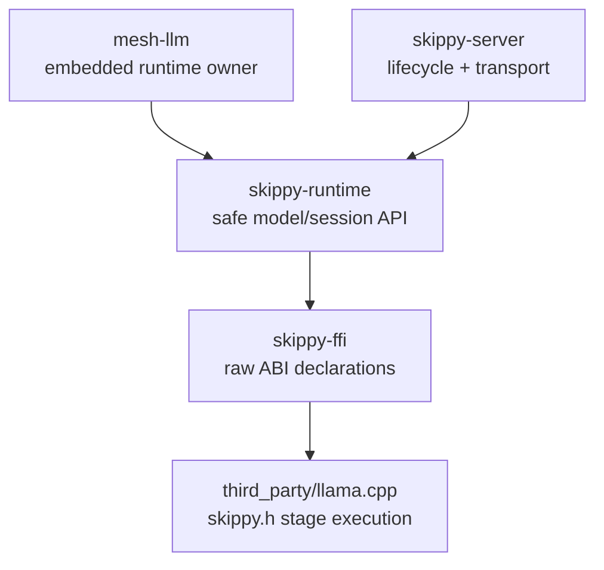
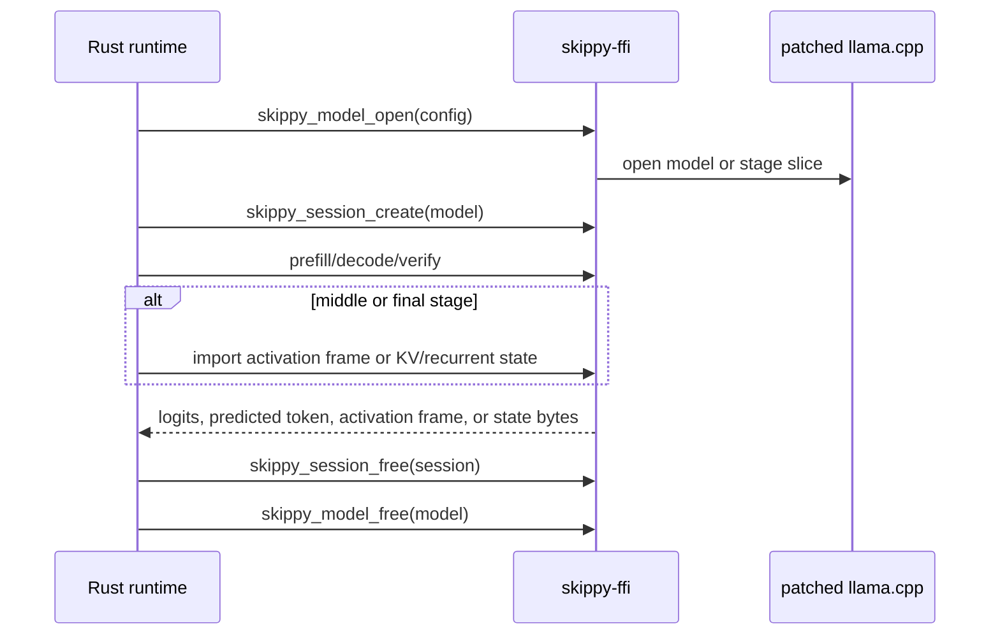

# skippy-ffi

Raw Rust declarations for the experimental skippy C ABI.

This crate should stay thin: no topology, protocol, benchmark, or product
behavior belongs here. Prefer adding safe behavior in `skippy-runtime`.

## Responsibilities

- bind to `skippy.h`
- expose C-compatible constants, structs, and function declarations
- keep ABI ownership and error shapes explicit
- link the staged llama.cpp and ggml static archives selected by
  `LLAMA_STAGE_BUILD_DIR`

Consumers should use `skippy-runtime` unless they are extending the ABI
boundary itself.

## Architecture Role

`skippy-ffi` is the lowest Rust layer in the staged stack. It exposes the
patched llama.cpp ABI without owning policy:

Keep this crate close to the C ABI. Higher-level behavior such as topology
validation, activation wire conversion, exact-cache policy, package
materialization, telemetry, and benchmark policy belongs in the crates above it.

## Build Integration

By default the build script statically links the staged llama.cpp checkout from
`.deps/llama.cpp/build-stage-abi-static`. Prepare and build it with
`just llama-build`. Set `LLAMA_STAGE_BUILD_DIR` to point at another
prepared build directory, for example a Linux GPU backend build:

| Backend | Expected ggml archive | Runtime libraries linked on Linux |
| --- | --- | --- |
| CUDA | `ggml/src/ggml-cuda/libggml-cuda.a` | `cuda`, `cudart`, `cublas`, `cublasLt` |
| ROCm/HIP | `ggml/src/ggml-hip/libggml-hip.a` | `amdhip64`, `rocblas`, `hipblas` |
| Vulkan | `ggml/src/ggml-vulkan/libggml-vulkan.a` | `vulkan` |

The backend archives are optional. The build script links each one only when it
exists in `LLAMA_STAGE_BUILD_DIR`, so CPU-only and accelerator builds share the
same Rust crate.

## ABI Contract

The staged ABI is versioned as `0.1.32`. The patch header in
`third_party/llama.cpp/patches/` and the Rust constants in
`crates/skippy-ffi/src/lib.rs` are the source of truth, so keep this README
aligned with those files instead of treating it as canonical prose.

Version `0` is still experimental, so callers should treat the ABI as
feature-probed rather than permanently stable.

The runtime-event additions are part of that `0.1.26` bump. They add versioned
`SkippyRuntimeEventV1` and `SkippyRuntimeEventReporterV1` structs, keep
`detail_len` fixed-width as `u64`, and pass the reporter as a separate pointer
argument on the `_with_events` model-open entrypoints instead of extending
`RuntimeConfig`.

Version `0.1.31` adds `skippy_ngram_simple_draft`, a stateless adapter for
llama.cpp's upstream self-speculative `ngram-simple` proposer.

Version `0.1.32` adds a request-owned adapter for llama.cpp's upstream
`ngram-cache` proposer. Callers reset or append only target-committed tokens;
an optional provisional continuation is read-only input to drafting.

The Rust FFI layer binds `skippy_abi_features`. This README records ABI intent
and compatibility expectations only; higher-level gating belongs in
`skippy-runtime` or later tasks.

All `skippy_*` functions either return `skippy_status` or, for ABI
discovery/error helpers, return plain values directly. Functions that accept
`out_error` may allocate a `skippy_error`; callers must pass it to
`skippy_error_free` after reading the status/message.

Opaque handles are caller-owned after successful creation:

| Handle | Created by | Released by |
| --- | --- | --- |
| `skippy_model` | `skippy_model_open` | `skippy_model_free` |
| `skippy_session` | `skippy_session_create` | `skippy_session_free` |
| `skippy_model_info` | `skippy_model_info_open` | `skippy_model_info_free` |
| `skippy_slice_plan` | `skippy_slice_plan_create` | `skippy_slice_plan_free` |

Buffer-writing functions use the usual C ABI sizing pattern: the caller passes a
pointer, a capacity, and an output byte/count pointer. If the buffer is too
small, the function returns `BUFFER_TOO_SMALL` and reports the required size in
the output pointer when the implementation can compute it.

## Protocol Shape

The same ABI supports single-stage inference, split runtime stages, state
movement, tokenizer/chat helpers, and model slicing:

## Feature Flags

`skippy_abi_features` returns a bitmask of the capabilities compiled into
the patched llama.cpp library. The Rust FFI layer binds this function, and
`skippy-runtime` uses it together with ABI and symbol checks to decide whether
`_with_events` should be selected. Callers that want feature probing can still
read it directly:

| Feature | Bit | Surface |
| --- | ---: | --- |
| `RUNTIME_SLICE` | `1 << 0` | Runtime layer-range execution via `RuntimeConfig` and execution calls |
| `LAYER_PACKAGE` | `1 << 1` | Layer-package load mode |
| `ARTIFACT_SLICE` | `1 << 2` | Artifact-slice load mode |
| `MODEL_INTROSPECTION` | `1 << 3` | `skippy_model_info_*` tensor metadata calls |
| `GGUF_SLICE_WRITE` | `1 << 4` | `skippy_slice_plan_*`, `skippy_write_*` |
| `TOKENIZE_DETOKENIZE` | `1 << 6` | Tokenization, detokenization, EOG checks |
| `ACTIVATION_FRAME` | `1 << 7` | Descriptor-plus-payload execution calls |
| `SESSION_RESET` | `1 << 9` | `skippy_session_reset` |
| `BATCH_VERIFY` | `1 << 10` | `skippy_verify_tokens` |
| `CHAT_TEMPLATE` | `1 << 11` | `skippy_apply_chat_template` |
| `SAMPLING_CONFIG` | `1 << 12` | Sampled decode calls using `SamplingConfig` |
| `BATCH_VERIFY_FRAME` | `1 << 13` | `skippy_verify_tokens_frame` |
| `LOGIT_BIAS` | `1 << 15` | `SamplingConfig.logit_bias` |
| `SESSION_TRIM` | `1 << 16` | `skippy_trim_session` |
| `SESSION_CHECKPOINT` | `1 << 17` | Native checkpoint/restore calls |
| `PACKAGE_PART_LOAD` | `1 << 18` | Ordered GGUF package part loading |
| `GENERATION_SIGNALS` | `1 << 19` | Generation progress and cancellation signal hooks |
| `EXTERNAL_MEDIA_PREFILL` | `1 << 20` | Multimodal prefill from externally materialized media chunks |
| `CHAT_TEMPLATE_TOOLS` | `1 << 21` | llama.cpp OpenAI-compatible chat templating and tool-call response parsing |
| `CHAT_SAMPLING_GRAMMAR` | `1 << 22` | Session-local llama.cpp grammar-constrained sampling from chat template metadata |
| `BACKEND_DEVICES` | `1 << 23` | Backend-device capability reporting |
| `RUNTIME_EVENTS` | `1 << 24` | `_with_events` model-open entrypoints and runtime-event callbacks |
| `NATIVE_MTP_N1` | `1 << 25` | Typed, non-frame native MTP draft sideband |
| `NGRAM_SIMPLE_DRAFT` | `1 << 26` | llama.cpp upstream `ngram-simple` proposal over accepted token history |
| `NGRAM_CACHE_DRAFT` | `1 << 27` | Stateful request-local llama.cpp `ngram-cache` proposer |

Runtime-event compatibility expectations are narrow on purpose:

| Case | Shipped behavior |
| --- | --- |
| feature bit missing | If `FEATURE_RUNTIME_EVENTS` is absent, `skippy-runtime` falls back to `skippy_model_open` and `skippy_model_open_from_parts` without events. |
| symbol missing | If the `_with_events` symbol is not available, `skippy-runtime` falls back to the legacy no-events open path. |
| legacy runtime / older runtime without event support | Older or otherwise legacy runtimes that do not advertise the feature bit and `_with_events` entrypoints stay on the legacy no-events open path. |
| null callback/reporter | A null reporter or null callback is treated as no reporter. Native open still proceeds, just without runtime-event delivery. |
| smaller reporter struct | Native validates `abi_version` and `struct_size`. A smaller reporter struct returns `SKIPPY_STATUS_INVALID_ARGUMENT`, and a mismatched reporter ABI version returns `SKIPPY_STATUS_UNSUPPORTED`. |
| native crash bypassing callback reporting | Callbacks cannot report process crashes. Segfaults and aborts still bypass the callback boundary. |

- `skippy-runtime` also requires ABI/version checks before selecting the
  `_with_events` entrypoints; failing those checks keeps the legacy no-events
  path in charge.
- Event callbacks stay operation-scoped, and v1 guarantees no callback after
  the `_with_events` entrypoint returns.

## Function Surface

This section maps every C function in the stage ABI, plus the upstream llama log
hook currently bound by this crate.

### Upstream llama hook

| Function | Purpose |
| --- | --- |
| `llama_log_set` | Installs a llama.cpp log callback and opaque user pointer. This comes from upstream `llama.h`, not `skippy.h`. |

### ABI discovery and errors

| Function | Purpose |
| --- | --- |
| `skippy_abi_version` | Returns the compiled stage ABI version. The C header exports it; this Rust crate mirrors the version through constants. |
| `skippy_abi_features` | Returns the compiled feature bitmask. Rust binds this function in `skippy-ffi`; higher-level consumers can use it for feature probing or gating. |
| `skippy_error_free` | Frees an allocated `skippy_error`. |

### Model and session lifecycle

| Function | Purpose |
| --- | --- |
| `skippy_model_open` | Opens a GGUF model, runtime slice, layer package, or artifact slice using `RuntimeConfig`, including optional selected backend device placement. This is the legacy no-events entrypoint. |
| `skippy_model_open_with_events` | Opens a model with a runtime-event reporter. Requires the runtime-event feature bit and the native symbol. |
| `skippy_model_free` | Releases a model handle. |
| `skippy_session_create` | Creates a decode session/context from an opened model. |
| `skippy_session_reset` | Clears session state so the session can be reused. |
| `skippy_checkpoint_session` | Records a native session checkpoint and returns the checkpoint token count. |
| `skippy_restore_session_checkpoint` | Restores the native checkpoint when the requested token count matches. |
| `skippy_session_configure_chat_sampling` | Configures session-local sampling with llama.cpp chat metadata so tool-call grammars constrain generated tokens. |
| `skippy_session_free` | Releases a session handle. |
| `skippy_trim_session` | Trims session state to a token count. |

### Model open from parts

| Function | Purpose |
| --- | --- |
| `skippy_model_open_from_parts` | Opens a package-backed model from GGUF parts using the legacy no-events path. |
| `skippy_model_open_from_parts_with_events` | Opens a package-backed model from GGUF parts with a runtime-event reporter. Requires the runtime-event feature bit and the native symbol. |

### Execution

| Function | Purpose |
| --- | --- |
| `skippy_prefill_chunk` | Prefills a token chunk using raw activation buffers for staged input/output. |
| `skippy_verify_tokens` | Runs batched token verification and returns the model-selected tokens. |
| `skippy_decode_step_sampled` | Decodes one token with `SamplingConfig`, including penalties and logit bias. |
| `skippy_prefill_chunk_frame` | Prefills a token chunk using `ActivationDesc` plus payload buffers. |
| `skippy_decode_step_frame_sampled` | Decodes one token with activation-frame I/O and `SamplingConfig`. |

### Self-speculative proposal

| Function | Purpose |
| --- | --- |
| `skippy_ngram_simple_draft` | Calls llama.cpp's upstream `ngram-simple` proposer with accepted history and returns only the proposed continuation. It owns no persistent cache state. |
| `skippy_ngram_cache_create` / `free` | Allocates or releases a request-owned cache handle. |
| `skippy_ngram_cache_reset` / `append` | Rebuilds or extends the cache with target-committed token history only. |
| `skippy_ngram_cache_draft` | Drafts after committed history and an optional non-mutating continuation prefix, such as a native MTP candidate. |

### Token and chat helpers

| Function | Purpose |
| --- | --- |
| `skippy_tokenize` | Tokenizes text with optional special-token insertion. |
| `skippy_detokenize` | Converts token IDs back to text bytes. |
| `skippy_token_is_eog` | Reports whether a token is an end-of-generation token. |
| `skippy_apply_chat_template` | Applies the model chat template, with optional assistant prompt and thinking-mode override. |
| `skippy_apply_chat_template_json` | Applies llama.cpp's OpenAI-compatible chat template path from JSON messages, tools, and tool-choice metadata, returning the prompt plus parser metadata. |
| `skippy_parse_chat_response_json` | Parses generated assistant text with llama.cpp's chat parser and returns an OpenAI-compatible assistant message JSON object, including tool calls when emitted by the model. |

### Model introspection and GGUF writing

| Function | Purpose |
| --- | --- |
| `skippy_model_info_open` | Opens model metadata without creating an execution session. |
| `skippy_model_info_free` | Releases model metadata. |
| `skippy_model_info_tensor_count` | Returns the number of tensors visible through model metadata. |
| `skippy_model_info_tensor_at` | Returns tensor metadata for one index. |
| `skippy_slice_plan_create` | Creates a GGUF slicing plan from model metadata. |
| `skippy_slice_plan_free` | Releases a slicing plan. |
| `skippy_slice_plan_add_layer_range` | Adds one stage layer range and embedding/output ownership flags to a plan. |
| `skippy_write_slice_gguf` | Writes one planned stage slice as a GGUF artifact. |
| `skippy_write_gguf_from_parts` | Composes multiple GGUF parts into one materialized package. |
