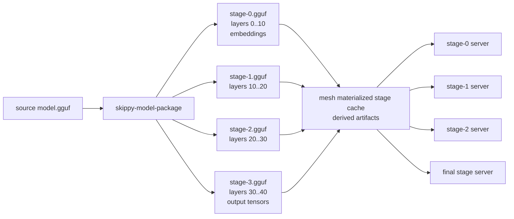

# skippy-model-package

Model inspection and stage-package CLI.

This tool uses llama-backed model introspection through the C ABI. GGUF writing
must go through llama.cpp writer code exposed by the ABI; Rust owns package
planning, manifests, checksums, and CLI behavior.

## Architecture Role

`skippy-model-package` prepares the per-stage model artifacts consumed by
`skippy-server` through the mesh materialization cache. Each stage owns one
contiguous layer range and loads a sparse GGUF shard or a materialized package
slice:



Mesh treats these generated shards as derived cache. Package-backed models use
stable Hugging Face identity from `model-ref`/`model-hf`; direct local GGUFs are
materialized as synthetic package inputs instead of using the path stem as a
model id.

## Commands

```bash
skippy-model-package inspect model.gguf
skippy-model-package plan model.gguf --stages 4
skippy-model-package write model.gguf --layers 0..12 --out stage-0.gguf --manifest stage-0.json
skippy-model-package write-stages model.gguf --stages 4 --out-dir slices/
skippy-model-package write-package org/repo:Q4_K_M --out-dir model-package/
skippy-model-package write-package org/repo:Q4_K_M --projector mmproj-model-f16.gguf --out-dir model-package/
skippy-model-package quant-pack source-plan unsloth/Qwen3-Coder-480B-A35B-Instruct-GGUF \
  --revision main \
  --local-dir /Volumes/External/models/qwen3-coder-480b \
  --allow-pattern 'UD-Q4_K_XL/*.gguf' \
  --quant-pack-out-dir target/skippy-quant-packs/qwen3-coder-480b \
  --expected-download-bytes 275600000000 \
  --min-free-bytes 330000000000 \
  --hf-jobs-workload-out qwen-hf-job-workload.sh \
  --hf-jobs-submit-json-out qwen-hf-job-submit.json \
  --hf-jobs-image ghcr.io/<owner>/skippy-quant-pack-job:cpu \
  --hf-jobs-timeout 36h \
  --hf-jobs-upload-repo <owner>/<repo> \
  --out qwen-source-plan.json \
  --script-out fetch-qwen-source.sh
skippy-model-package quant-pack hf-jobs-validate qwen-hf-job-submit.json \
  --expected-image ghcr.io/<owner>/skippy-quant-pack-job:cpu \
  --expected-upload-repo <owner>/<repo>
skippy-model-package quant-plan model.gguf --profile coding-agent --stages 4 --out quant-plan.json
skippy-model-package quantize model.gguf --plan quant-plan.json --candidate middle-compressed --out-dir quantize-run/ --emit-only
skippy-model-package quantize model.gguf --plan quant-plan.json --candidate middle-compressed --out-dir quantize-run/ --llama-quantize /path/to/llama-quantize --keep-split
skippy-model-package write-package quantize-run/middle-compressed.gguf --agent-pack quantize-run/agent-pack.json --out-dir model-package/ \
  --model-id org/repo:middle-compressed --source-revision abc123 --source-file Qwen3-Coder-Q4_K_M.gguf
skippy-model-package quant-pack finalize quantize-run/quantize-run.json \
  --out-dir quant-pack-run/ \
  --package-dir model-package/ \
  --model-id org/repo:middle-compressed \
  --source-revision abc123 \
  --source-file Qwen3-Coder-Q4_K_M.gguf \
  --stages 4 \
  --reuse-package-if-present
skippy-model-package quant-pack build model.gguf --profile coding-agent --stages 4 --candidate middle-compressed \
  --llama-quantize /path/to/llama-quantize --out-dir quant-pack-run/ \
  --model-id org/repo:middle-compressed --source-revision abc123 --source-file Qwen3-Coder-Q4_K_M.gguf \
  --keep-split
skippy-model-package quant-pack build model.gguf --profile coding-agent --stages 4 --candidate middle-compressed \
  --llama-quantize /path/to/llama-quantize --out-dir quant-pack-run/ \
  --model-id org/repo:middle-compressed --decode-profile
skippy-model-package quant-pack build-all model.gguf --profile coding-agent --stages 4 \
  --llama-quantize /path/to/llama-quantize --out-dir quant-pack-candidates/ \
  --model-id-prefix org/repo --candidate baseline-source-quant --candidate middle-compressed \
  --ctx-size 8192 --n-gpu-layers -1 --cache-type-k f16 --cache-type-v f16 --activation-wire-dtype f16 \
  --keep-split --decode-profile
skippy-model-package quant-pack rank quant-pack-run/ other-candidate-run/ --ctx-size 8192 --cache-type-k f16 --cache-type-v f16 --activation-wire-dtype f16 --out quant-rank.json
skippy-model-package quant-pack evidence-plan quant-pack-run/ \
  --hosts host-a,host-b,host-c,host-d \
  --splits 10,20,30 \
  --ctx-size 8192 \
  --n-gpu-layers -1 \
  --cache-type-k f16 \
  --cache-type-v f16 \
  --activation-wire-dtype f16 \
  --skippy-bench-bin ./target/debug/skippy-bench \
  --skippy-model-package-bin ./target/debug/skippy-model-package \
  --agent-tool-call-script ./scripts/qa-agent-tool-call-reliability.py \
  --kv-tool-loop-script ./scripts/qa-kv-tool-loop-stability.py \
  --runbook-cwd . \
  --remote-root /tmp/skippy-runtime-bench \
  --remote-root-map host-b=/Volumes/External/skippy-runtime-bench \
  --remote-shared-root-map host-a=/Volumes/External/skippy-runtime-bench \
  --endpoint-host-map host-b=192.168.0.4,host-c=192.168.0.3 \
  --ssh-opts '-o BatchMode=yes -o ConnectTimeout=5 -p 2222' \
  --metrics-otlp-grpc-url http://host-a:14317 \
  --lab-preflight-script scripts/qwen-lab-preflight.sh \
  --lab-preflight-hosts 192.168.0.2,192.168.0.4,192.168.0.3,192.168.0.5 \
  --lab-preflight-min-free-gb 80 \
  --lab-preflight-ssh-opts '-o BatchMode=yes -o ConnectTimeout=5' \
  --rsync-model-artifacts \
  --evidence-dir quant-pack-run/evidence \
  --out quant-pack-run/evidence-plan.json \
  --script-out quant-pack-run/run-evidence.sh
skippy-model-package quant-pack evidence-plan-all quant-pack-candidates/ \
  --hosts host-a,host-b,host-c,host-d \
  --splits 10,20,30 \
  --top-ranked 2 \
  --skippy-bench-bin ./target/debug/skippy-bench \
  --skippy-model-package-bin ./target/debug/skippy-model-package \
  --agent-tool-call-script ./scripts/qa-agent-tool-call-reliability.py \
  --kv-tool-loop-script ./scripts/qa-kv-tool-loop-stability.py \
  --runbook-cwd . \
  --out quant-pack-candidates/evidence-plan-all.json \
  --script-out quant-pack-candidates/run-evidence.sh
skippy-model-package quant-pack evidence-plan quant-pack-run/ \
  --hosts studio-stage-0,studio-stage-1,studio-stage-2 \
  --splits 16,32 \
  --include-local-split-evidence \
  --skippy-bench-bin ./target/debug/skippy-bench \
  --skippy-model-package-bin ./target/debug/skippy-model-package \
  --out quant-pack-run/evidence-plan.json \
  --script-out quant-pack-run/run-evidence.sh
skippy-model-package quant-pack evidence-status quant-pack-run/evidence-plan.json --fail-on-missing
skippy-model-package quant-pack certify quant-pack-run/ \
  --skippy-bench-report target/bench-runs/qwen-coder/focused-runtime-report.json \
  --skippy-bench-report target/bench-runs/qwen-coder/chat-corpus.json \
  --skippy-bench-report target/bench-runs/qwen-coder/long-context-chat-corpus.json \
  --skippy-bench-report target/bench-corpora/long/prompt-lengths-summary.json \
  --quality-evidence target/agent-tool-call-reliability/results.jsonl \
  --quality-evidence target/kv-tool-loop-stability/qwen-coder/summary.json \
  --require-skippy-bench --require-quality-evidence \
  --ctx-size 8192 \
  --n-gpu-layers -1 \
  --cache-type-k f16 \
  --cache-type-v f16 \
  --activation-wire-dtype f16 \
  --out quant-pack-run/certification.json
skippy-model-package validate model.gguf slices/stage-*.gguf
skippy-model-package validate-package model.gguf model-package/
skippy-model-package profile model.gguf --stages 4 --phase decode --existing-kv-tokens 32768
skippy-model-package profile model-package/ --stages 4 --phase decode --existing-kv-tokens 32768 --warmup-samples 3 --samples 20
skippy-model-package profile model.gguf --timing-source local-stage --stages 1 --phase decode --warmup-samples 3 --samples 20
```

`write` and `write-stages` call the llama C ABI, which uses llama.cpp GGUF
writer code for artifact metadata and streams selected tensor bytes from the
source model. The Rust CLI owns planning, manifests, file checksums, and
validation reports.

`validate` checks that every owned tensor from the source model appears exactly
once across the supplied artifact slices, with no unknown tensors and no
duplicate owned tensors. Shared metadata and tokenizer KVs are preserved by the
llama-backed writer.

`write-package` prefers model coordinates such as `org/repo:Q4_K_M`. It resolves
the coordinate through `model-ref`, `model-artifact`, and the `huggingface-hub`
backed `model-hf` adapter, downloads the resolved source artifact, and records
the resolved repo, revision, primary file, canonical ref, distribution id, and
artifact file set in `model-package.json`.
Layer packages store input-boundary tensors in `shared/embeddings.gguf` and
final-boundary tensors in `shared/output.gguf`; owned tensors should appear in
exactly one package artifact.

Multimodal projectors are explicit package artifacts. Pass one or more
`--projector path/to/mmproj*.gguf` arguments to `write-package`; the CLI copies
them into `projectors/`, fingerprints them, records them as `kind: "mmproj"` in
`model-package.json`, and `validate-package` checks the declared projector
checksums and sizes. Package-backed serving uses the first declared projector
when no explicit `projector_path` is supplied by the caller.

Local paths are only accepted for package creation when the caller supplies
explicit provenance:

```bash
skippy-model-package write-package ./model.gguf \
  --out-dir model-package/ \
  --model-id org/repo:Q4_K_M \
  --source-revision abc123 \
  --source-file Qwen3-8B-Q4_K_M.gguf
```

This keeps canonical package identity tied to real model coordinates rather
than inferred from arbitrary filesystem paths.

`quant-pack source-plan` writes the reproducible source-acquisition handoff for
large Hugging Face GGUF repos. It emits the `hf download` command, records the
revision, local directory, include patterns, selected source GGUF or first shard
placeholder, and prints a follow-on `quant-pack build-all` command template.
Pass `--script-out` to write an executable fetch script. The script downloads
source files, discovers the first downloaded `.gguf`, derives `--source-file`
from its basename, and deliberately only prints the `build-all` command so a
huge quantization sweep does not start by accident. For Qwen Coder-sized split
repos, keep `--keep-split` enabled and pass `--source-file` when you want to pin
a known first shard instead of relying on script discovery. Pass
`--expected-download-bytes` to serialize the dry-run source size and
`--min-free-bytes` to make the generated script check free space before starting
the Hugging Face download.
For 480B-scale candidates, pass `--hf-jobs-workload-out` and submit the
generated workload to Hugging Face Jobs or another remote runner instead of
running the quantization sweep on Studio. The workload downloads the source
inside the job, discovers or pins the source shard, runs
`quant-pack build-all`, and uploads outputs when `HF_UPLOAD_REPO` is set. It
expects `HF_TOKEN`, `SKIPPY_MODEL_PACKAGE_BIN`, and `LLAMA_QUANTIZE` to be
available in the job environment unless explicit paths were serialized in the
plan.
Pass `--hf-jobs-submit-json-out` with `--hf-jobs-image` to also write a
reviewable Hugging Face Jobs `run` payload. The image must contain
`skippy-model-package`, `llama-quantize`, `hf`, and any backend libraries needed
for the selected quantization path. The generated payload is not submitted by
the CLI; it records the image, flavor, timeout, command, `HF_TOKEN` secret, and
optional `HF_UPLOAD_REPO` environment value for an explicit operator handoff.
Build the CPU job image with
`just docker-build-quant-pack-job ghcr.io/<owner>/skippy-quant-pack-job:cpu`,
then push it with `just docker-push-quant-pack-job
ghcr.io/<owner>/skippy-quant-pack-job:cpu` before using that image in a Hugging
Face Jobs submit payload.
The current Qwen 480B handoff is tracked in
`docs/runbooks/QWEN480_SKIPPY_QUANT_PACK_HF_JOB.md`.
Run `quant-pack hf-jobs-validate` before submission to check that the payload
uses the HF Jobs `run` shape, a known flavor, `detach=true`, `HF_TOKEN` as a
secret, source download, `quant-pack build-all`, idempotent output repo
creation, and upload of generated outputs. This is the default
`--workload-kind source-build-all` validation mode.
The validation report also renders an equivalent `hf jobs run ...` command
under `hf_jobs_cli.shell` for operators who prefer the Hugging Face CLI over the
MCP/API payload.

`quant-plan` starts the reproducible Skippy quant-pack flow. It inspects a
source GGUF and emits deterministic candidate layouts such as source baseline,
boundary-protected, middle-compressed, FFN-compressed with attention protected,
and stage-balanced. Each candidate carries a stable versioned `layout_hash`,
stage hints, protected tensor groups, and toolchain identity so later
quantization, certification, and ranking can refer to the same layout. The
attention-protected candidate keeps middle-band attention tensors at a safer
tier for long-context recall while lowering middle-band FFN tensors for Skippy
latency and memory pressure. Protection tiers are capped by the source GGUF's
inferred quant tier, so a Q4 source is protected from further lowering without
being up-quantized into a larger artifact that cannot recover lost precision.
Use the original source GGUF or split GGUF shard set for this step; generated
Skippy materialized stage/tokenizer slice files are rejected because they are
derived cache artifacts, not complete quantization sources.
For MoE-style coder models, the coding-agent profile also detects
router/expert tensor names such as `ffn_gate_inp` and `*_exps` and emits
specific protection groups before broad middle-layer compression rules, so
latency candidates do not accidentally lower those tensors first. Router tensors
use a higher precision tier, while expert tensors use a source-aware floor that
never drops below the initial Q4_K_M protection tier.

`quantize` consumes one candidate from a `quant-plan` report. In `--emit-only`
mode it writes the exact llama `tensor-types.txt` override file and
`agent-pack.json` metadata without mutating model bytes. The generated
`quantize-run.json` also records the exact tensor override entries, because
llama's override file format does not allow comments. With `--llama-quantize`
it invokes a llama.cpp quantizer binary using the selected layout's default
quant and tensor overrides. The resulting GGUF can then be passed to
`write-package --agent-pack quantize-run/agent-pack.json` so the layer package
manifest records the quant layout identity that preflight, certification, and
ranking consume. Use `--keep-split` for split GGUF sources such as very large
Qwen Coder artifacts so llama writes quantized output in the same shard shape
instead of one monolithic file. The agent-pack metadata includes the source GGUF path, hash,
inferred source quant, selected layout hash, and tensor groups.

`quant-pack finalize` turns an existing `quantize-run.json` into the standard
candidate run shape without running the quantizer again. It packages the
recorded quantized GGUF with the adjacent `agent-pack.json`, runs package
preflight, and writes `quant-pack-build.json` so `rank`, `evidence-plan`, and
`certify` can consume the candidate. Pass `--reuse-package-if-present` after a
long package materialization has already completed; the command will reuse the
existing `model-package.json`, rerun preflight, and regenerate the build
manifest. This is the resume path for Qwen-sized runs where quantization and
package writing are expensive enough to split into supervised steps.

`quant-pack build` is the reproducible one-shot path for a selected candidate.
It writes `quant-plan.json`, runs `quantize`, packages the resulting GGUF with
`agent-pack.json`, preflights the package, saves `preflight.json`, and records
a top-level `quant-pack-build.json` pointing at each intermediate artifact.
The build manifest also records the resolved source identity, quantizer path,
thread/split policy, package validation policy, and requested decode-profile
shape so the candidate can be audited without chasing CLI history.
With `--decode-profile` it also measures local single-stage decode for the
generated GGUF and writes `decode-profile.json`. Use the lower level
`quant-plan`, `quantize`, and `write-package` commands when you need to inspect
or modify a candidate by hand.

`quant-pack rank` compares one or more `quant-pack build` run directories. It
prefers valid packages with attached `certification.json` evidence, measured
decode profiles, higher focused-runtime generated-token throughput from
certification evidence, then lower mean decode latency, lower slowest-stage
artifact plus estimated KV cache bytes for the selected context/cache shape,
lower stage-size imbalance, and lower estimated activation transfer bytes per
decoded token for the selected activation wire dtype. Agent-quality certified
candidates outrank uncertified candidates unless the measured runtime gap is
large enough to justify more investigation; failed certifications are heavily
penalized. Before certification is written, ranking also looks for the standard
generated `evidence/focused-runtime-report.json`, `evidence/chat-corpus.json`,
`evidence/prompt-lengths-summary.json`, and
`evidence/local-split-chain.json` files so a sweep can rerank immediately after
`skippy-bench` finishes. Those direct evidence files are provisional: usable
reports can supply runtime throughput, evidence counts, and local split
transfer bytes, but measured focused-runtime must be `mode: executed`, chat
corpus must have zero errors, token lengths must fit context, and local split
chain reports must have a predicted token plus positive boundary wire bytes.
The rank report records `activation_transfer_source` as
`certified_local_split_chain`, `direct_local_split_chain`, or
`preflight_estimate`, so transfer-cost scoring remains auditable while sweeps
move from provisional Studio evidence to certified evidence.
Schema-smoke or failed reports do not boost provisional rank output; when such
direct reports are present, rank notes explain which evidence was ignored and
why. Usable direct evidence notes name the lanes that counted, for example
`token-lengths` or `focused-runtime, chat-corpus, token-lengths,
local-split-chain`, so partial Qwen runs are easier to resume. Only
`quant-pack certify` binds the reports to artifact hashes. Ranking reads either
`certification.json` at the candidate root or the runbook-generated
`evidence/certification.json`, preferring the generated evidence copy when both
exist. Certified evidence reports only contribute rank measurements and counts
when their summarized status is `pass`; failed attached reports remain audit
evidence without improving candidate score. Ranking requires certification to be
verifiable: it checks the `subject`
artifact hashes and the attached evidence report hashes against the current
build, and it checks that the certification `runtime_shape` matches the rank
request's context, GPU-layer, KV-cache, and activation-wire settings. When the
certification records an expected topology, rank also verifies its stage count,
layer end, and split boundaries against the current preflight stage ranges.
Stale, wrong-shape, wrong-topology, or unverifiable certification is treated as
failed instead of letting old quality or runtime evidence bless changed
GGUF/package/report files, and its attached runtime measurements are ignored
for rank scoring.
The output is a transparent ranking report, not a certification generator.

`quant-pack evidence-plan` reads a `quant-pack build` run and emits the exact
machine-readable command plan for the next evidence pass: `skippy-bench
token-lengths`, `skippy-bench focused-runtime --schema-smoke`,
`skippy-bench focused-runtime`, coding-loop `skippy-bench chat-corpus`,
long-context `skippy-bench chat-corpus`, the agent QA scripts,
`quant-pack certify`, and a final `quant-pack rank` that writes
`rank-after-evidence.json`. It reads
`model_id` and `layer_count` from `package/model-package.json`, uses the
candidate's quant-plan `stage_hints` as the default staged split when present,
falls back to even split boundaries for older or ad hoc manifests, and lets
`--splits` override both when a specific topology is being certified. The
report serializes the candidate `stage_count`, and the command requires one
host per planned stage. Generated bench commands pin the
tokenizer layer count, context size, decode budget, activation wire dtype,
thinking mode, coding corpus, and staged GPU-offload policy so the evidence is
reproducible. When the default corpus paths are used, the plan also includes
the matching `just bench-corpus long` and `just bench-corpus coding-loop`
preparation commands. Pass `--skippy-bench-bin` and
`--skippy-model-package-bin` to bake exact local tool paths into the JSON and
runbook; pass `--agent-tool-call-script` and `--kv-tool-loop-script` to do the
same for the quality probes. Otherwise the generated commands use
`skippy-bench` and `skippy-model-package` from `PATH` plus the repo-local
default QA script paths. This is the handoff from candidate construction to
real Skippy hardware certification.
Pass `--runbook-cwd` to pin the local working directory used by generated
scripts; when omitted it records the directory where the evidence plan was
generated. The runbook `cd`s there before warning checks, corpus prep, and
relative command paths, so it can be launched from another shell directory or a
background runner without changing behavior.
Pass `--execution-run-dir` when the candidate is inspected locally but the
evidence run will execute from a different filesystem root, such as a lab node
or Hugging Face Job that downloads the candidate bundle under
`/tmp/skippy-evidence/input/<candidate>`. The planner still reads the local
`quant-pack-build.json` and package manifest, but generated commands point
`run_dir`, `package`, `quantized_model`, and the default `evidence/` directory
at the execution path. The report keeps `source_run_dir` when this rebasing is
active, so audits can distinguish the local planning source from the runtime
artifact location.
When writing a local runbook for a different execution filesystem, pass
`--runbook-plan-path` with the plan path that will exist in that execution
environment. The runbook then uses that path for `evidence-status` warning and
semantic skip checks, instead of the local `--out` path used to write the JSON
artifact.
For remote evidence execution, pass `--hf-jobs-workload-out` with
`--hf-jobs-input-repo` to write an executable Hugging Face Jobs workload script.
Pass `--hf-jobs-input-upload-script-out` to also write the companion upload
script for that input repo. The upload script uses `hf upload-large-folder` with
include patterns for the quantized GGUF, `package/**`, `quantize/**`, and
provenance JSON files, while excluding stale local `evidence/**`, evidence
plans, submit JSON, and runbooks. The workload downloads that candidate bundle
into `--execution-run-dir`, writes the generated evidence plan and runbook into
the same execution filesystem, runs the runbook, and uploads `evidence/`,
`evidence-plan.json`, and `run-evidence.sh` when `HF_UPLOAD_REPO` or
`--hf-jobs-upload-repo` is set. Pass `--hf-jobs-submit-json-out` with
`--hf-jobs-image` to also write a reviewable HF Jobs `run` payload containing
the image, flavor, timeout, detached command, `HF_TOKEN` secret, and optional
upload repo environment. The CLI only writes handoff artifacts; it does not
upload or submit the job.
Validate this payload with
`quant-pack hf-jobs-validate --workload-kind evidence-run` before submission.
Evidence-run validation checks the HF Jobs envelope plus candidate download,
embedded evidence-plan/runbook writes, evidence-status resume checks, runbook
execution, concrete non-placeholder runtime hosts, upload repo creation, and
evidence upload.
The generated schema-smoke command writes `focused-runtime-schema-smoke.json`
from the same split, layer-end, context, KV cache, activation-wire, corpus, and
lab-option arguments as the measured run, but without launching remote stages.
It catches bad topology or command-shape changes before the operator spends lab
time on the full focused-runtime measurement.
Pass `--include-local-split-evidence` for a Studio/local proof lane when the
split topology has at least two boundaries, such as a 48-layer Qwen coder proxy
with `--splits 16,32` or a four-stage Qwen-scale topology with
`--splits 16,32,47`. The plan inserts
`skippy-bench local-split-chain-binary` before remote lab work and writes
`evidence/local-split-chain.json`, which records the predicted token plus
the observed first-boundary activation payload/wire byte counts plus
same-shape estimates for later decode boundaries. `quant-pack certify` can
attach this report as optional
`skippy-bench-local-split-chain` evidence, and `evidence-status` treats it as
partial unless the report has a predicted token and nonzero payload bytes. This
proves local stage chaining, split correctness, and transfer size for a
candidate; it does not replace measured distributed `focused-runtime` evidence
for real multi-node latency.
Do not use this direct-GGUF local lane as the default proof path for 480B-scale
models. It may launch one local process per stage, and each process can map or
load tens of GiB before becoming ready. For Qwen-scale candidates, prefer
package-backed lab evidence or Hugging Face Jobs for quantize/package/profile
work, then attach the resulting machine-readable reports. The local chain has a
high-memory guard and requires an explicit override for large direct-GGUF
multi-stage runs.
Pass `--lab-preflight-script` to insert an explicit checked command between the
schema smoke and measured run. For the Qwen lab, `scripts/qwen-lab-preflight.sh`
can write `focused-runtime-lab-preflight.txt` after checking SSH reachability,
stale processes, common lab ports, and free disk; the generated wrapper writes
`focused-runtime-lab-preflight.ok` only after that script exits successfully, so
`evidence-status` will not advance past a failed preflight log. Tune it with
`--lab-preflight-min-free-gb` and `--lab-preflight-ports`. The Qwen preflight
also records local IPv4 addresses and routes to failed SSH hosts when SSH cannot
connect, so stale subnet or VPN assumptions are visible in the evidence log.
The `skippy-bench focused-runtime --hosts` values are SSH targets for remote
stage launch, so they must resolve over SSH. Use `--lab-preflight-hosts` only when the
preflight should check additional or equivalent host strings, and use
`--endpoint-host-map` for separate stage fabric/IP addresses. If the measured
runtime launch needs a nondefault SSH port, user, key, or timeout policy, pass
`--ssh-opts`; if the preflight needs the same policy, pass
`--lab-preflight-ssh-opts` too. Evidence plans warn when preflight SSH options
are set but runtime SSH options are absent, because that can make preflight pass
while `skippy-bench` remote launch still uses default SSH.
Pass focused-runtime lab options such as `--remote-root`,
`--remote-root-map`, `--remote-shared-root-map`, `--endpoint-host-map`,
`--metrics-otlp-grpc-url`, `--metrics-server-bin`, `--stage-server-bin`,
`--work-dir`, `--rsync-model-artifacts`, or `--keep-remote` to bake the actual
`skippy-bench focused-runtime` deployment settings into the generated JSON and
shell runbook. That keeps the evidence command tied to the same remote roots,
fabric addresses, metrics collector, and binaries used for the measured run.
When the split comes from quant-plan `stage_hints`, the generated
`focused-runtime` command also passes `--allow-uneven-stage-ranges` so
Skippy-native latency/byte-balanced stage plans are not rejected by the older
raw-layer-balance guard. Explicit CLI `--splits` remain raw-layer-balanced
unless that same flag is passed as a focused-runtime lab option.
Pass `--script-out` to write an executable bash runbook containing the same
ordered commands as the JSON report. When the evidence-plan path is known, the
script first runs `quant-pack evidence-status --fail-on-warning` so suspicious
host or SSH configuration stops the run before lab time is spent. The generated
script checks that each declared output exists after its command completes. It
also skips a command only when all declared outputs already exist and
`quant-pack evidence-status --command-complete` says the command is complete, so
interrupted Qwen-scale evidence runs do not silently accept a stale or
semantically failed JSON report. Partial commands still rerun because at least
one declared output, such as a preflight `.ok` marker, is missing or because a
known JSON output failed semantic validation.
After certification succeeds, the runbook reruns `quant-pack rank` with the
same runtime-shape arguments and writes `rank-after-evidence.json` in the
evidence directory. That artifact is the immediate post-benchmark decision
report for the candidate.

`quant-pack evidence-status` reads an evidence-plan JSON or evidence-plan-all
JSON and checks every declared output path. It emits a compact resume report
with complete vs missing command counts and the next missing command's shell
line. Candidate entries preserve the evidence topology from the plan, including
hosts, stage count, split boundaries, split source, and layer end, so an
interrupted run can be audited from the status output alone. Commands with some
outputs present and some outputs missing are marked
`partial`, which is useful for failed lab preflights that left diagnostic logs
but not the `.ok` success marker. When a partial text log contains an obvious
failure line, the command and next-command entries include `observed_failure`
so the resume report explains whether the next action is a dirty host, SSH
transport, or another failed check. Evidence-plan warnings are preserved on the
top-level status and candidate entries, so host/SSH configuration risks remain
visible in resume tooling. Known generated JSON outputs are also checked for
semantic failure: measured `focused-runtime` stays partial unless the report is
`mode: executed` with generated throughput and decode p50 latency,
`chat-corpus`/`long-context-chat-corpus` stay partial when their summaries have
errors, `token-lengths` stays partial when any row exceeds context, rank outputs
stay partial when they are malformed or their `candidate_count` disagrees with
the candidates array, and `certify` stays partial when `certification.json` is
failed, malformed, or status-less. Status also checks completed
`focused-runtime`, `local-split-chain`, and `token-lengths` reports against the
plan's declared runtime/topology shape where the plan provides it, including
context size, GPU-layer policy, KV dtypes, activation wire dtype, split
boundaries, stage count, and layer end. A stale `ctx_size=1024` report therefore
does not satisfy a resumed `ctx_size=8192` evidence plan. The separate
`focused-runtime-schema-smoke` step accepts `mode: schema-smoke` only as a
command-shape check. New generated commands also carry an `evidence_type` lane
label such as `skippy-bench-focused-runtime`, `skippy-bench-chat-corpus`,
`skippy-bench-long-context-chat-corpus`,
`skippy-bench-local-split-chain`, or `skippy-bench-token-lengths`; status uses
that stable lane label for semantic checks when it is present and falls back to
command ids for older plans.
For evidence-plan-all reports, status also tracks
the top-level final sweep rank as `final_rank` and counts it in the aggregate
complete/missing command totals. Use `--fail-on-missing` when a lab wrapper or
CI job should stop until the remaining `skippy-bench` or QA reports have been
produced. Use `--fail-on-warning` when suspicious host or SSH configuration
should also stop an automated evidence pass before lab time is spent. Status
also audits declared local toolchain paths such as `skippy-bench`,
`skippy-model-package`, the QA scripts, and focused-runtime helper
binaries/scripts, plus the recorded runbook working directory; missing,
non-executable, or missing-directory inputs become warnings, so
`--fail-on-warning` catches a bad runbook before remote hardware is touched.

This is intentionally a bridge to `skippy-bench`, not a replacement for it.
`skippy-model-package` owns artifact construction, package provenance, early
rank reports, and certification binding. `skippy-bench` owns the expensive
runtime evidence: staged latency/throughput, OpenAI-compatible chat behavior,
and tokenizer/context-fit audits. The profiler is cheap triage; the
`skippy-bench` reports are the proof.

`quant-pack evidence-plan-all` reads a `quant-pack build-all` run and emits the
same evidence command plan for every candidate, or for each repeated
`--candidate` filter. Pass `--top-ranked N` to select the first `N` valid
candidates from the build-all rank report, skipping candidates that failed
package preflight. It inherits the build-all context size, GPU-layer policy, KV
cache dtypes, and activation wire dtype unless those flags are overridden, and
writes per-candidate evidence directories under a shared evidence root. Use it
after the early rank report to create reproducible `skippy-bench` plans for the
candidates that deserve hardware time.
With `--script-out`, the all-candidate script emits one section per selected
candidate, hoists shared corpus-preparation commands into one setup section,
runs each candidate's remaining evidence commands in order, skips commands
whose declared outputs are already present, and stops on the first missing
declared output after a command runs. After all selected candidate sections
finish, the script writes a sweep-level `evidence/rank-after-evidence.json`
that compares the selected run directories with the same runtime-shape inputs.

`quant-pack certify` attaches evidence to a built quant-pack candidate. It does
not run the benchmark workload itself: `skippy-bench` owns focused runtime,
chat corpus, and token-length reports, while QA scripts own agent behavior and
cache-loop evidence. The certify command reads those machine-readable artifacts,
checks package preflight and decode-profile gates, summarizes evidence hashes,
checks the focused-runtime context size, GPU-layer policy, KV cache dtypes, and
activation wire dtype, verifies focused-runtime split topology against the
candidate's quant-plan stage hints when available, and emits a
`skippy_quant_pack_certification` report. The report serializes the certified
runtime shape plus the expected split topology when quant-plan stage hints are
available, so rank and audit tooling can verify the Skippy shape without
scraping gate text. Focused-runtime evidence only passes when it is a real
executed `skippy-bench` report with generated throughput and decode p50
latency; schema-smoke output never certifies performance. Without quality evidence
the best status is `measurement_only_candidate`; a candidate only becomes
`agent_quality_candidate` when package, profiling, `skippy-bench`, and quality
evidence gates all pass, including both agent tool-call and KV/tool-loop
coverage. With `--require-skippy-bench`, certification requires
passing `focused-runtime`, coding-loop `chat-corpus`, long-context
`chat-corpus`, and `token-lengths` reports, so a pack cannot look certified
from a single latency-only measurement. Required
`skippy-bench` reports must also identify the candidate by model id or
quantized model path; subject-less required reports fail certification instead
of producing an ambiguous promotion artifact.
Evidence reports inside the candidate run are recorded with run-dir-relative
paths so `rank` can recheck their hashes after the run directory is moved or
resumed from another shell; outside evidence is recorded by absolute path.
The report's `subject` block hashes the quantized GGUF, package manifest,
agent-pack metadata, preflight output, build manifest, and quantize-run
manifest so later comparisons can prove which candidate artifacts were actually
certified.

`quant-pack build-all` runs the same selected-candidate build flow for every
candidate in a quant plan, or for each repeated `--candidate` value when a
smaller sweep is desired. It writes one candidate directory per layout, then
writes a top-level `quant-pack-rank.json` and `quant-pack-build-all.json`.
The build-all runtime-shape flags are passed into the rank report so early
candidate triage uses the same context size, GPU-layer policy, KV cache dtypes,
and activation wire dtype that later evidence and certification will check.
The sweep manifest records the shared quantizer, split-output, package
validation, decode-profile request, and rank runtime-shape assumptions once at
the top level; each candidate manifest records its resolved source/package
identity and artifact paths. Each candidate entry also includes an artifact
inventory and readiness summary for the quantized model, package, preflight,
decode profile, evidence directory, and certification path, so missing local
build artifacts are visible before lab time is spent. It also includes
`next_steps.evidence_plan_all`, a command template for generating the
`skippy-bench`/certification evidence plan for the top-ranked valid candidates;
replace the generated `--hosts` placeholder with one reachable host per stage.
Model ids are derived as `<model-id-prefix>:<candidate-id>`.

When `--require-quality-evidence` is used, certification expects passing quality
coverage from both `scripts/qa-agent-tool-call-reliability.py` and
`scripts/qa-kv-tool-loop-stability.py`. Other quality artifacts are still
summarized, but they do not by themselves promote a candidate to
`agent_quality_candidate`.

`validate-package` checks the source-model checksum, manifest artifact checksums
and sizes, declared tensor counts/bytes, layer coverage, duplicate layers, and
exact owned tensor coverage against the source model.

`profile` emits a planner-ready JSON profile envelope for a layer package or
direct GGUF. The initial implementation records input identity, request
shape, layer artifact
summaries, split-stage artifact summaries, runtime/ABI identity, and explicit
`not_measured` timing placeholders through the default `--timing-source static`
source. Native per-layer decode timing hooks will fill the same report shape
later without changing the serving request path.

`profile` also accepts a direct GGUF. Direct GGUF profiles use llama-backed
introspection to summarize layer tensor bytes, shared tensor bytes, and
synthetic split-stage byte totals before a package has been written. This lets
operators profile candidate source models before choosing a split or mixed
quantization layout.

`--timing-source local-stage` is the first measured lane for direct-GGUF
stage-level decode timing. It currently supports direct GGUF inputs with
`--stages 1`, `--phase decode`, and `--generated-tokens 1`, then fills
`stages[0].timing` and `summary.estimated_tokens_per_second`.
