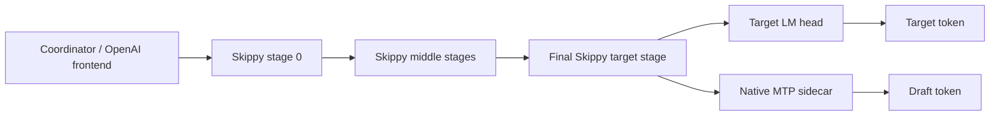
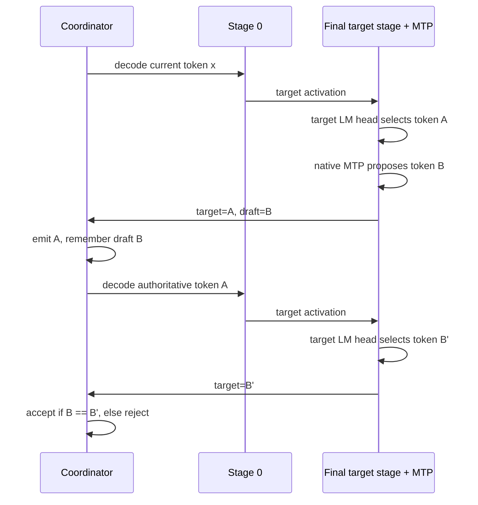
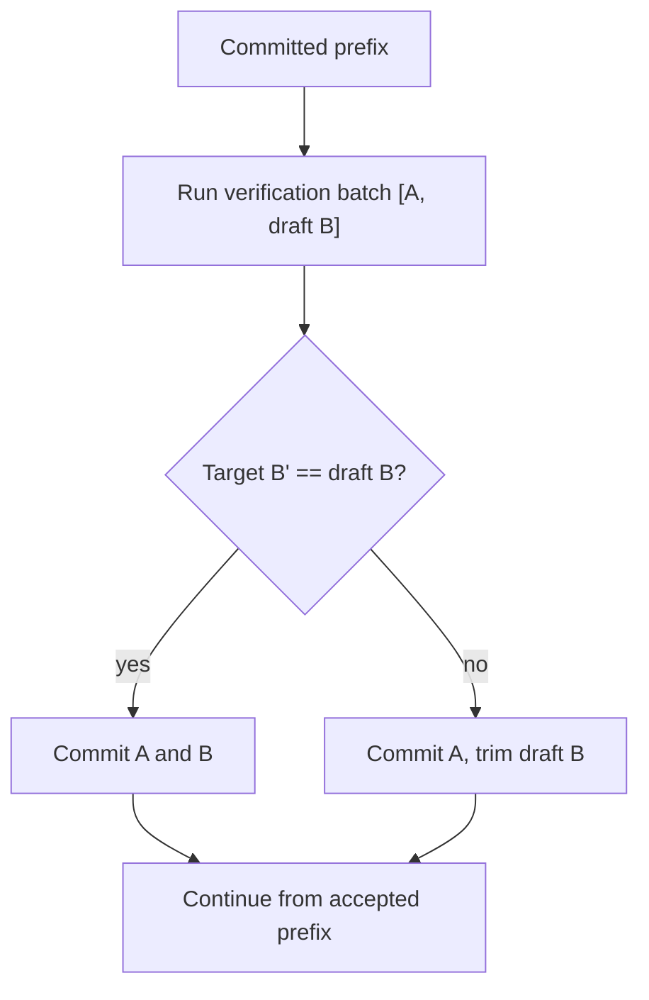

# GLM Native MTP in Skippy

## Goal

Build GLM native MTP in two ordered steps:

1. Native MTP `n=1` correctness.
2. Batched verification for latency amortization.

The existing batched verification ABI in the llama.cpp patch queue is historical.
Do not treat it as the architecture for this work. The new path should start
from native MTP proposal semantics and add batching only after one-token
correctness is proven.

## Current GLM-4.7 Evidence

HF metadata checked on 2026-06-15 shows `zai-org/GLM-4.7-Flash` is the native
MTP source checkpoint and `unsloth/GLM-4.7-Flash-GGUF` publishes the existing
Skippy-certified public GGUF:

- base model: `zai-org/GLM-4.7-Flash`;
- model class: 30B-A3B MoE;
- checkpoint architecture: `Glm4MoeLiteForCausalLM`;
- checkpoint config: `num_hidden_layers = 47`,
  `num_nextn_predict_layers = 1`, `hidden_size = 2048`;
- checkpoint MTP tensors live at layer `47`:
  - `model.layers.47.eh_proj.weight`;
  - `model.layers.47.enorm.weight`;
  - `model.layers.47.hnorm.weight`;
- existing public Skippy artifact:
  `unsloth/GLM-4.7-Flash-GGUF:Q4_K_M`;
- Skippy certified split plan: `layer_end=47`, `splits=15,31`, activation
  width `2048`;
- Skippy wire dtype: `f16` by default, with q8 already validated for the
  existing non-MTP parity path;
- upstream model card shows native framework MTP with
  `--speculative-config.method mtp` and
  `--speculative-config.num_speculative_tokens 1`.

That makes GLM-4.7 Flash the right first target for native `n=1` MTP in Skippy:
it is small enough to exercise locally, already certified for stage splitting,
and has an upstream native one-token MTP path to compare against.

The public `GLM-4.7-Flash-Q4_K_M.gguf` is not enough for this milestone. Its
GGUF metadata reports `general.architecture = "deepseek2"` and
`deepseek2.block_count = 47`, and a tensor-name scan found no `next`, `mtp`,
`eh_proj`, `enorm`, or `hnorm` tensors. The checkpoint has the native MTP
tensors, but the public GGUF appears to have dropped them. Phase 1 therefore
needs a custom GLM-4.7 GGUF quantization from checkpoint that preserves the
layer-47 MTP tensors, then a Skippy layer package built from that GGUF.
The target Hub repo for that custom artifact is
`meshllm/GLM-4.7-Flash-MTP-GGUF`.

The model-backed Step 1 gate should use the correctness harness with a required
draft sideband:

```bash
skippy-correctness chain \
  --model /path/to/GLM-4.7-Flash-Q4_K_M-mtp.gguf \
  --model-id meshllm/GLM-4.7-Flash-MTP-GGUF:Q4_K_M \
  --layer-end 48 \
  --splits 15,31 \
  --activation-wire-dtype f16 \
  --require-native-mtp-draft
```

Use the layer count from the MTP-preserving GGUF/package when setting
`--layer-end`. If the converter stores 47 authoritative target layers plus one
NextN layer, the Skippy proof command should use `--layer-end 48`; if the layer
package exposes only authoritative target layers and attaches MTP as sidecar
metadata, use the package topology instead.

The important invariant is that the report must show
`matches = true`, `native_mtp.sideband_present = true`, and
`native_mtp.authoritative_matches_reply = true`.

## Runtime Shape

Native MTP is a proposer sidecar attached to the target runtime. It is not a
Skippy trunk stage and it is not an external draft model.



The final target stage is the natural owner for native MTP because it already
has the last target hidden state and logits. The MTP sidecar should run against
that target state and return one proposed future token.

## Step 1: Native MTP n=1 Correctness

The first milestone should not try to amortize network latency. It should prove
that Skippy can obtain one native MTP draft token, compare it against the next
authoritative target decode, and report accept/reject metrics without changing
greedy output.



Important properties:

- Target KV state remains authoritative.
- No target rollback is needed in this milestone.
- The MTP sidecar may need reset or advance logic after every observed target
  token so its proposal state follows the committed target prefix.
- The visible token stream is always produced by target tokens.
- Metrics can still count `drafted`, `accepted`, `rejected`, accept rate, MTP
  proposal latency, and target verification latency.

This milestone can be slower than baseline. Its job is correctness and
instrumentation.

## Step 1 ABI

The smallest useful stage ABI is a target decode that can optionally return a
native MTP draft:

```text
skippy_decode_step_frame_sampled_mtp(
    session,
    token_id,
    sampling,
    input_activation,
    output_activation,
    out_target_token,
    out_mtp_draft_token,
    out_mtp_status,
    out_mtp_compute_us,
)
```

The actual naming can differ, but the contract should stay this small:

- one target input token;
- one target sampled/greedy output token;
- zero or one native MTP draft token;
- no speculative target commit semantics;
- no multi-token verification batch;
- no external draft model path.

If the model has no compatible native MTP head, the ABI should return
`out_mtp_status = unavailable` and the Rust loop should behave exactly like
baseline Skippy.

## Step 2: Batched Verification

Only after Step 1 is correct should Skippy add batched verification. Batched
verification sends the target token and the one MTP draft token through the
target stage chain together as a provisional suffix.

```mermaid
sequenceDiagram
    participant C as Coordinator
    participant S0 as Stage 0
    participant S1 as Middle stages
    participant SF as Final target stage + MTP

    C->>S0: verification batch [A, draft B]
    S0->>S1: activation batch [A, draft B]
    S1->>SF: activation batch [A, draft B]
    SF->>SF: target predicts [B', C']
    SF->>C: predictions [B', C'], optional next MTP draft
    C->>C: if B == B': commit A,B; else commit A only
    C->>S0: commit/trim decision
```

The target stages must treat the draft token as provisional. If the target does
not agree with the draft, every stage must discard KV/state for the rejected
draft position.



This is where latency can be amortized. With an accept rate near 67%, one stage
chain traversal often advances more than one visible token.

## Batched Verification Contract

The new batched contract should be transactional and native-MTP-aware:

```text
VerificationBatch {
    committed_prefix_tokens: u64,
    tokens: [target_token, mtp_draft_token],
    draft_start: 1,
    draft_count: 1,
    mode: mtp,
}

VerificationBatchReply {
    target_predictions: [token_after_target, token_after_draft],
    mtp_draft_after_last_committed: optional token,
    timings,
}

CommitDecision {
    commit_token_count: 1 or 2,
}
```

The commit decision is separate from the batch execution because only the
coordinator can compare the returned target prediction with the draft token and
decide how much of the provisional suffix is valid.

## Sampling Scope

The first correctness gate should be greedy or otherwise deterministic. Batched
verification with sampling is a later problem because sampler history must be
advanced consistently for each provisionally accepted position.

For the GLM coding-agent lab goal, the first usable target is:

- deterministic decode;
- native MTP `n=1`;
- accept/reject metrics;
- no target rollback in Step 1;
- transactional target rollback only in Step 2.

## Non-Goals

- Reusing the discarded batched verification ABI as the design center.
- Treating MTP heads as ordinary Skippy trunk layers.
- External draft-model speculation.
- `n=2` or `n=3` before `n=1` is proven.
- Multi-host throughput claims before single-node correctness and metrics pass.

## Acceptance Gates

Step 1 is complete when:

1. A GLM model with native MTP produces nonzero MTP draft attempts through
   Skippy.
2. Greedy output is byte-identical to Skippy baseline.
3. Accept/reject metrics are emitted.
4. Disabling native MTP returns to baseline behavior.

Step 2 is complete when:

1. Batched verification commits accepted draft positions and trims rejected
   provisional positions correctly.
2. Greedy output remains byte-identical to Skippy baseline.
3. Stage telemetry reports batch size, accepted draft count, rejected draft
   count, commit count, trim count, and latency.
4. `skippy-bench` artifacts show throughput versus Skippy baseline.
