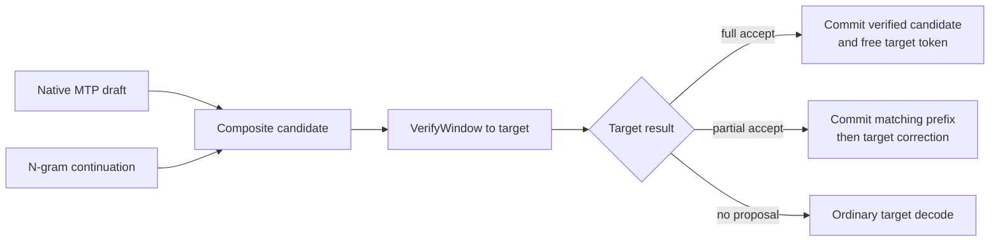
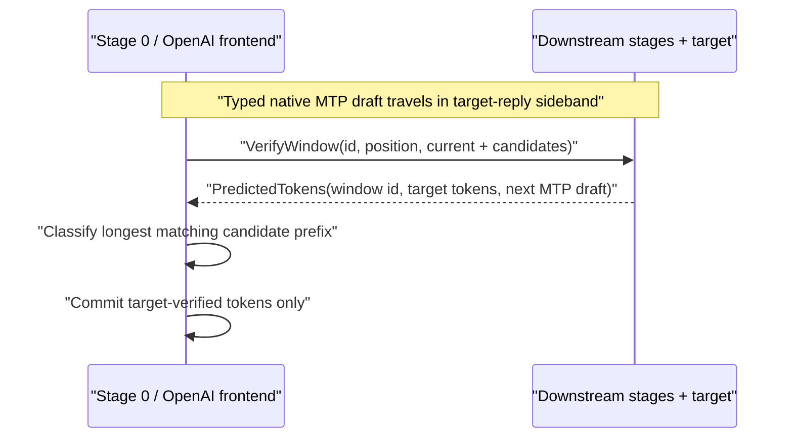
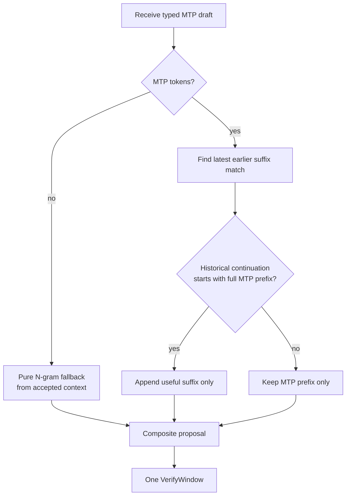
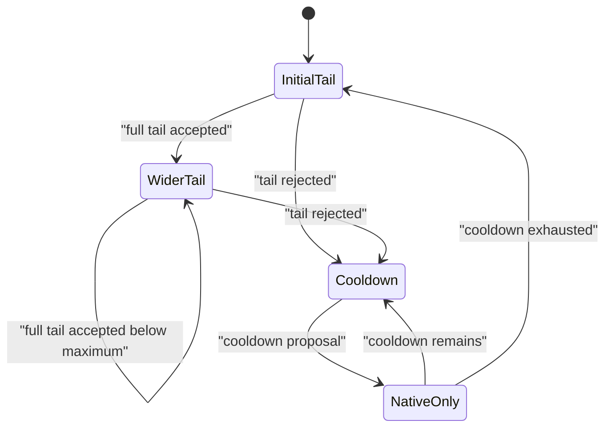
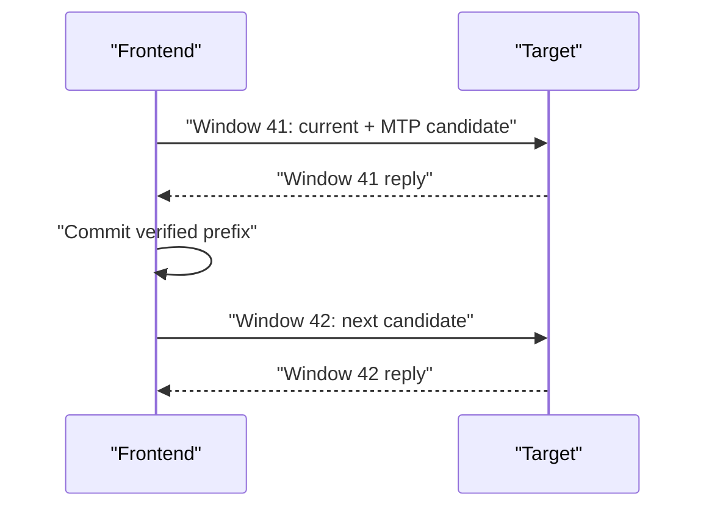
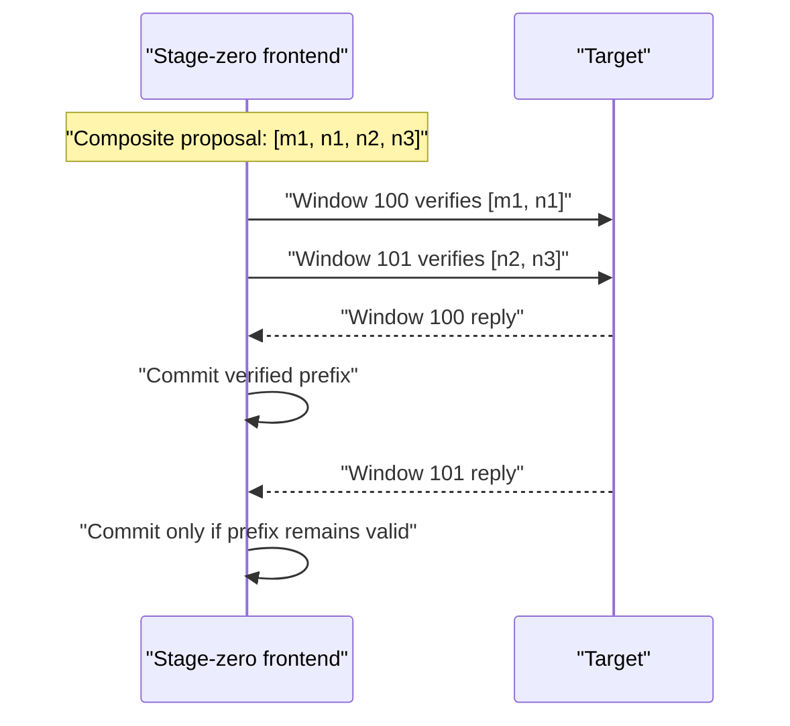
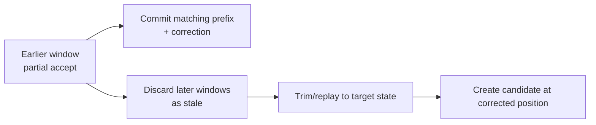
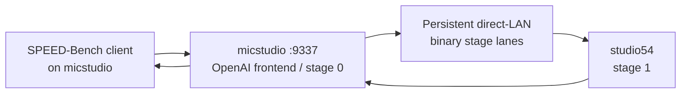

# Pipelined VerifyWindow Decode

## Purpose

This document describes Skippy's internal speculative-decode subsystem for
native multi-token prediction (MTP) and the optional MTP-anchored N-gram
extender. It covers the wire protocol, target-verification invariant,
asynchronous scheduling, operating modes, and diagnostic telemetry.

The staged-runtime protocol deliberately has no compatibility path for the
retired synchronous `VerifySpan` message. Public mesh gossip and the
OpenAI-compatible API retain their normal compatibility guarantees.

## Terms

| Term | Meaning |
|---|---|
| Target | The full staged model, authoritative for every emitted token. |
| Native MTP | Model-provided typed draft attached to a target reply. GLM 4.7 Flash currently supplies a narrow `N+1` candidate. |
| N-gram sidecar | An upstream llama.cpp `ngram-simple` lookup or request-local `ngram-cache` proposer over target-committed tokens. |
| Composite proposal | Native-MTP prefix plus an optional N-gram suffix. |
| VerifyWindow | Versioned target request that verifies a candidate span at one session position. |
| Free target token | Target's next token after a fully verified span. |
| Stale window | Optimistic in-flight window invalidated by an earlier divergence. |

## Safety Invariant

MTP and N-gram are candidate sources, never authorities. The target verifies
each candidate sequence, and Skippy commits only the longest target-matching
prefix. A target correction is committed after a rejection.



This invariant also applies when multiple windows are in flight.

## Wire Protocol

`STAGE_STATE_VERSION` is `8`. `VerifyWindow` is wire message kind `21`; the
legacy kind `10` is rejected. An old/new staged-runtime pairing therefore fails
clearly instead of silently interpreting requests with different semantics.



Pipelined decode requires direct prediction return. The target reply must reach
stage zero through the upstream-opened return sink; configuration fails when
that sink is unavailable.

## Composite Proposals

The sidecar extends native MTP; it never replaces it. Skippy uses upstream
llama.cpp proposers rather than a second Rust history scanner. `ngram-simple`
requires a historical continuation to begin with every MTP token before its
remaining tokens can become the sidecar tail. The request-local `ngram-cache`
instead reads directly after the provisional MTP prefix and returns only the
tail.



For MTP `[a, b]`, a valid historical continuation must start `[a, b, ...]`.
The composite proposal becomes `[a, b, c, d]`, not two independent requests.
A one-token N-gram tail is discarded. A rejected tail does not count as an MTP
prefix rejection; it only backs off the sidecar.

The cache is never shared between requests and is updated only after target
tokens commit. Drafting with `[a, b]` is read-only, so a rejected VerifyWindow
cannot affect a later lookup. This permits a cache tail to follow MTP even when
the cache would not independently predict `[a, b]`.

## Adaptive Sidecar Policy

The sidecar begins with the smallest useful tail. A fully accepted tail widens
the next tail by one token, up to the configured maximum. A rejected tail resets
the width and enters sidecar cooldown. With no MTP token, pure N-gram can use
the available N-gram budget.



## Serial Native-MTP Mode

Native MTP alone uses serial VerifyWindow processing. A window is opened,
verified, classified, and committed before the next window begins.



This is the native-MTP parity path. It is not decode parallelism by itself.

## Pipelined Composite Mode

Concurrency is enabled only when a package-selected composite strategy sets
`verify_window_pipeline_depth > 1`. A deeper composite proposal is partitioned
into FIFO windows. The target's free-advance candidate is reserved as the next
window's optimistic current token, preventing duplicate KV positions.



Replies complete in FIFO window-id order. An earlier divergence invalidates
later optimistic windows. Skippy drains them, records them as stale, trims to
the committed target state, and resumes from the target correction.



## Verification Outcomes

| Target result | Committed output | Next action |
|---|---|---|
| Full accept | Candidate plus free target token where applicable | Continue; adaptive width may grow. |
| Tail rejection | MTP prefix and matching tail prefix, then correction | Back off sidecar only. |
| Prefix rejection | Matching prefix, then correction | Handle native MTP rejection and discard stale windows. |
| EOG | Verified prefix through EOG | Stop. |
| No candidate | Ordinary target token | Continue decode. |

## Running On The Two-Host Lab

Use the package-qualified model reference. The normal mesh runtime owns split
planning; do not replace it with a direct `gguf://` reference for this flow.

The package owns a tested declarative default. `mesh-llm` resolves that package
plan once at launch, applies model-level settings before global defaults, and
passes the resulting typed configuration to `skippy-server`. The server does
not read `SKIPPY_NATIVE_MTP_*`, `SKIPPY_NGRAM_CACHE_*`, or
`SKIPPY_VERIFY_WINDOW_*` from its request hot path. Those variables are retired
from supported operation.

### Package Strategy Shape

`model-package.json` names reusable proposers and strategies. A GLM 4.7 Flash
package can expose native MTP plus a request-local cache sidecar as follows:

```json
{
  "generation": {
    "speculative_decoding": {
      "default": "mtp-cache",
      "proposers": {
        "mtp": {
          "type": "native-mtp",
          "prediction_depth": 1,
          "layer_indices": [47]
        },
        "cache": {
          "type": "ngram-cache",
          "ngram_min": 2,
          "ngram_max": 6,
          "max_proposal_tokens": 10,
          "history_scope": "request"
        }
      },
      "strategies": {
        "mtp-cache": {
          "type": "composite",
          "primary": "mtp",
          "extender": "cache",
          "extension_policy": {
            "initial_tokens": 2,
            "max_tokens": 8,
            "tail_backoff_proposals": 5
          }
        }
      }
    }
  }
}
```

### Operator Configuration

Choose a package strategy with `speculative.strategy`. `auto` uses the package
default; `disabled` turns speculation off; `mtp` preserves the direct native
MTP path. A named strategy such as `mtp-cache` is valid only when the selected
package declares it. Operator settings only bound or tune the selected plan:

```toml
[defaults.speculative]
strategy = "auto"

[[models]]
model = "meshllm/GLM-4.7-Flash-MTP-GGUF:Q4_K_M"

[models.speculative]
strategy = "mtp-cache"
ngram_max_proposal_tokens = 10
extension_initial_tokens = 2
extension_max_tokens = 8
extension_tail_backoff_proposals = 5
verify_window_min_tokens = 1
verify_window_max_tokens = 6
verify_window_pipeline_depth = 2
```

### No MTP Baseline

```bash
mesh-llm serve meshllm/GLM-4.7-Flash-MTP-GGUF:Q4_K_M --split --no-draft
```

Use `[models.speculative] strategy = "disabled"` to make this an explicit
baseline instead of relying on environment variables.

### Native MTP Only

```bash
mesh-llm serve meshllm/GLM-4.7-Flash-MTP-GGUF:Q4_K_M --split --no-draft
```

Use `[models.speculative] strategy = "mtp"` to force this control.

### MTP With Cache-backed N-gram Extension

```bash
mesh-llm serve meshllm/GLM-4.7-Flash-MTP-GGUF:Q4_K_M --split --no-draft
```

Use `[models.speculative] strategy = "mtp-cache"` with the bounded settings
above. The package must declare the request-local cache proposer; this command
does not silently turn one on.

### Invocation Overrides

`mesh-llm serve` may temporarily override a package-selected strategy without
editing `config.toml`. CLI settings have highest precedence, then the selected
model entry, then `[defaults.speculative]`; unspecified CLI fields retain the
lower-layer value. The CLI cannot make an undeclared package proposer available.

```bash
mesh-llm serve meshllm/GLM-4.7-Flash-MTP-GGUF:Q4_K_M --split --no-draft \
  --speculative-strategy mtp-cache \
  --speculative-ngram-proposer cache \
  --speculative-extension-max-tokens 8 \
  --speculative-verify-window-pipeline-depth 2
```

The supported tuning flags are `--speculative-ngram-max-proposal-tokens`,
`--speculative-extension-{initial,max}-tokens`,
`--speculative-extension-tail-backoff-proposals`,
`--speculative-native-mtp-{reject-cooldown-tokens,suppress-cooldown-drafts,suppress-cooldown-draft-limit}`,
and `--speculative-verify-window-{min,max}-tokens` / `--speculative-verify-window-pipeline-depth`.
Use `--speculative-native-mtp-allow-cooldown-drafts` to explicitly override a
configured suppression policy to `false`.

### Standalone Skippy Server

`skippy-server` does not resolve layer-package recommendations. For isolated
stage-server operation it accepts a complete, already resolved JSON
`SpeculativeDecodeConfig` via `serve-binary --openai-speculative-config` or
`serve-openai --speculative-config`. The file is validated as one typed plan
before serving starts. This is intentionally not a second policy-merging path;
normal mesh serving always resolves the package and policy in `mesh-llm`.



The normal planner currently selected `micstudio 0..47` and `studio54 47..48`.
Record layer ranges, direct RTT, lane count, context size, and binary commit
with every benchmark. That shape proves normal split serving but is not directly
comparable to historic 22/26 benchmark rows.

## Telemetry And Interpretation

The OpenAI response `timings` object provides aggregate evidence; debug
telemetry supplies per-window and per-stage detail.

| Question | Counters |
|---|---|
| Is decode faster? | `predicted_per_second`, `predicted_n`, `predicted_ms` |
| Which plan actually ran? | `llama_stage.spec.requested_strategy`, `llama_stage.spec.effective_strategy` |
| Are proposals accepted? | `draft_n`, `draft_n_accepted` |
| Did the sidecar widen MTP? | `native_mtp_hybrid_native_tokens`, `native_mtp_hybrid_ngram_tokens`, `native_mtp_hybrid_proposed_tokens` |
| Did anchors agree? | `native_mtp_hybrid_ngram_mtp_prefix_agreements`, `native_mtp_hybrid_ngram_mtp_prefix_disagreements` |
| Were tails useful? | `native_mtp_hybrid_accepted_tail_tokens`, `native_mtp_hybrid_ngram_tail_rejections`, `native_mtp_hybrid_ngram_sidecar_backoffs` |
| Was it pipelined? | `verify_window_depth`, `verify_window_opened`, `verify_window_max_in_flight`, `verify_window_stale_discarded` |
| Where was time spent? | `verify_window_downstream_wait_ms`, `verify_window_forward_write_ms`, `verify_window_stage0_compute_ms`, `verify_window_verify_elapsed_ms` |

A useful hybrid run needs more than an increased `draft_n`: it needs accepted
tail tokens, high anchor agreement, bounded stale-window work, and completion
throughput higher than the native-MTP control.
