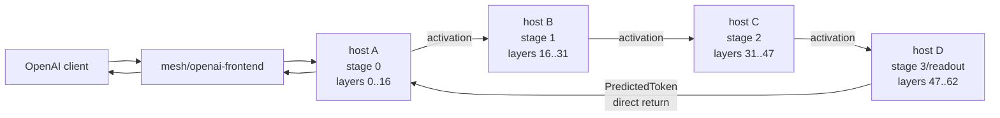
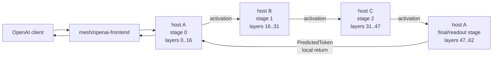

# Tip-to-Tip Stage Placement

Tip-to-tip placement puts the driver-facing tip and the final/readout tip on
the same physical peer. The middle stages stay on separate peers. This is the
next latency reduction after direct prediction return because it removes the
final network return hop from the no-spec decode loop.

## Baseline Direct Return

With four physical stage peers, generation-3 direct prediction return removes
the chained reply path, but every decoded token still crosses three activation
links and one direct return link.



At an assumed 10 ms inter-stage delay, the network-only decode floor is:

```text
S0 -> S1 -> S2 -> S3 -> S0
4 network hops * 10 ms = ~40 ms/token before compute
```

That is about 25 tok/s before model compute.

## Tip-to-Tip Placement

Tip-to-tip colocates the first and final logical stages on host A. The stage
graph still has four logical stages, but only three physical network hops are
serialized in the no-spec decode loop.



At the same 10 ms inter-stage delay, the network-only decode floor becomes:

```text
host A stage0 -> host B -> host C -> host A final/readout
3 network hops * 10 ms = ~30 ms/token before compute
```

That is about 33 tok/s before model compute. The win is not from smaller
payloads; it is from removing one serialized network wait from every generated
token.

## Resident Memory Estimate

The closest local package with complete artifacts is
`meshllm/Qwen3-Coder-480B-A35B-Instruct-UD-Q4_K_XL-layers`, cached at:

```text
~/.cache/huggingface/hub/models--meshllm--Qwen3-Coder-480B-A35B-Instruct-UD-Q4_K_XL-layers
```

Its package manifest reports 62 layer artifacts plus shared metadata,
embeddings, and output tensors. The table below scales those artifact bytes by
`350 / 480` to estimate a Qwen 3.6 350B-class `UD-Q4_K_XL` package with the same
layer-size shape. These are resident weight/artifact estimates. Runtime RSS
also needs KV cache, graph/work buffers, allocator slack, and any duplicated
runtime context for colocated logical stages.

| Placement | Physical peer | Logical layers | Cached 480B artifacts | 350B estimate |
| --- | --- | --- | ---: | ---: |
| Baseline | host A | `0..16` + embeddings | 71.08 GB | 51.83 GB |
| Baseline | host B | `16..31` | 65.55 GB | 47.80 GB |
| Baseline | host C | `31..47` | 71.25 GB | 51.95 GB |
| Baseline | host D | `47..62` + output | 68.07 GB | 49.64 GB |
| Tip-to-tip | host A | `0..16` + `47..62` + embeddings + output | 139.15 GB | 101.46 GB |
| Tip-to-tip | host B | `16..31` | 65.55 GB | 47.80 GB |
| Tip-to-tip | host C | `31..47` | 71.25 GB | 51.95 GB |

The placement requirement is clear: tip-to-tip asks the first peer to carry
about two logical stage slices. For this 350B-class estimate, that means host A
needs roughly 101.5 GB of resident model artifacts before KV/cache/runtime
overhead, while the middle peers stay around 48-52 GB each.

## Planner Implications

- Topology planning must distinguish physical peer identity from logical stage
  identity.
- A physical peer must be allowed to own multiple non-contiguous layer ranges.
- Split capacity checks need to sum all logical ranges assigned to a peer,
  including shared embeddings/output tensors.
- The final/readout stage should return predictions to the local stage-0 driver
  path without touching the network.
- Tip-to-tip should be preferred only when the first peer has enough memory and
  compute headroom to carry both tips without making the middle stages idle.
