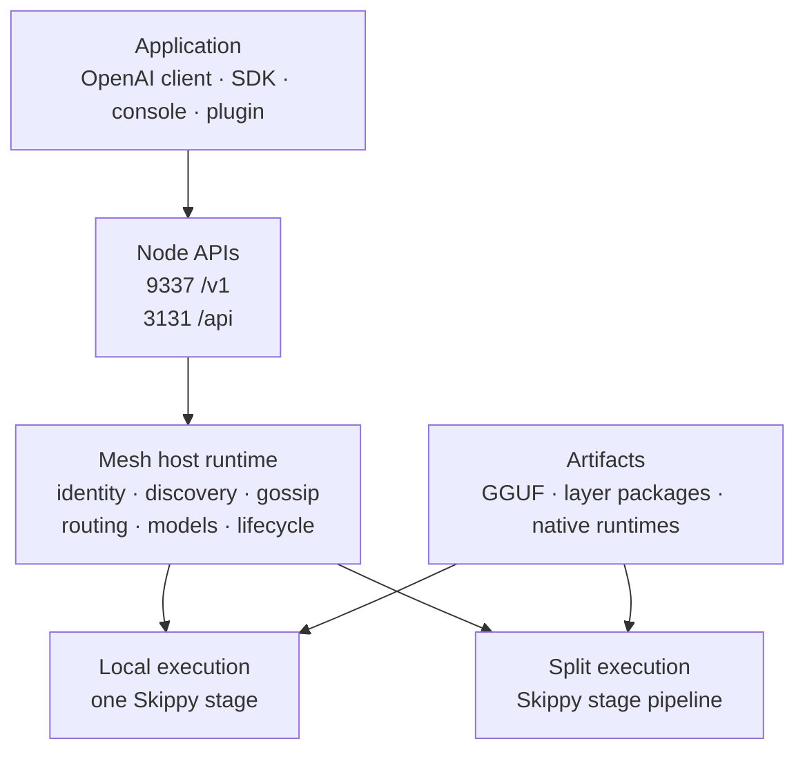
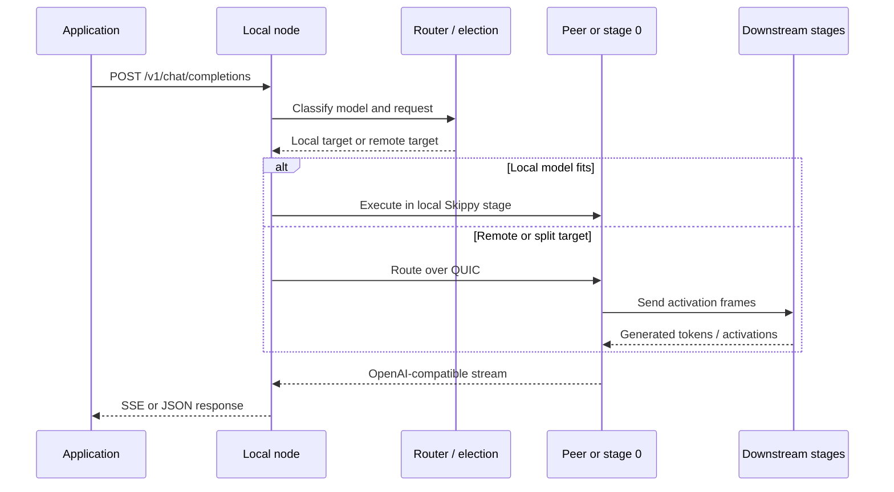
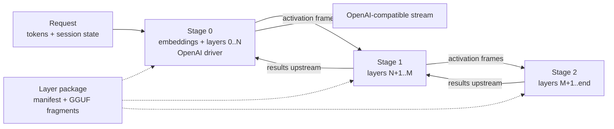

# Mesh LLM architecture

Mesh LLM turns several machines into one OpenAI-compatible inference surface. Each node can expose an API, participate in discovery and gossip, serve local models, route requests to peers, or provide compute for a model split.

This page is the map. It explains the boundaries between the mesh product, the Skippy execution runtime, and the model artifacts they consume. Use the linked deep dives when you need protocol fields, operational commands, or implementation details.

## The one-minute mental model

The important boundary is that mesh-llm owns the product and network behavior, while Skippy owns model execution. The OpenAI API stays stable whether the request is handled locally, by a peer, or by a multi-stage pipeline.

## Product and control surfaces

The inference API at `:9337/v1` is the application-facing path. The local management API at `:3131` supplies status, discovery, lifecycle, and runtime views to the React Mesh LLM console and to operators using scripts or the CLI. An owned node-control API provides configuration, inventory, and runtime commands for attested hosts through the owner-control lane; it uses explicit endpoint authorization and remains separate from the mesh plane used for join, gossip, routing, and inference.

## What happens to a request

1. An application sends an OpenAI-compatible request to the node's `/v1` endpoint. SDK clients may use direct mesh transport instead of a local HTTP listener.
2. The node classifies the request and reads the requested model, capability, and routing signals.
3. The router selects a local target, a peer host, or a stage-0 target for a split model. Model availability, hardware fit, demand, request affinity, and health all contribute to the decision.
4. If the target is remote, the node uses the mesh QUIC transport and a tunnel or route request to reach it. The caller still sees one local OpenAI endpoint.
5. If the target is split, stage 0 runs the input and sends activations downstream through Skippy stage transport. Later stages send results back toward the driver, which streams the OpenAI response.
6. Runtime status, model state, routing observations, and events are published to the management API and telemetry surfaces without changing the inference contract.

## How the mesh works

### Nodes and roles

Nodes are peers with a stable owner identity and mesh membership. Their runtime role depends on what they are doing:

| Role | Responsibility |
| --- | --- |
| Client | Consumes inference without contributing local model execution. |
| Host | Owns a routable model target and exposes the local inference API. |
| Worker | Provides compute or a stage for a model execution plan. |
| Standby | Has useful capacity or model state and can be promoted when demand or topology changes. |

Roles and live serving state are different concepts. A node can be connected while its model is loading, an endpoint is unhealthy, or its capacity is waiting for election.

### Discovery, admission, and gossip

Public meshes are discovered through published listings. Private meshes are joined with invite tokens; LAN deployments can use the configured local discovery mode. After transport negotiation, nodes exchange additive gossip containing peer identity, capabilities, model visibility, serving state, demand signals, and mesh metadata.

Discovery finds a candidate mesh. Admission decides whether the node is allowed to participate. Gossip tells admitted peers what the topology currently looks like. These are separate stages and should not be treated as one trust decision.

### Transport and compatibility

Mesh transport uses QUIC through iroh. A connection is multiplexed into control, gossip, route, tunnel, and lifecycle streams. The current protobuf lane uses ALPN `mesh-llm/1`; legacy JSON peers can still negotiate `mesh-llm/0` for mixed-version operation.

Protocol changes should be additive: older nodes must be able to ignore new optional fields, and newer nodes must continue to understand the legacy lane where compatibility is required. See the [protocol deep dive](https://github.com/Mesh-LLM/mesh-llm/blob/main/docs/design/message_protocol.md) for the wire-level contract.

### Routing and election

Every node exposes the same OpenAI-facing shape and can route a request to an eligible host or worker node. Routing is based on model identity rather than a user selecting a machine. Per-model election decides which node or stage-0 target is authoritative, while passive clients receive a smaller route view instead of full mesh gossip.

Routing also considers request affinity. Reusing a target for a shared prefix can preserve cache locality, while health and topology changes can drain or replace a target. The router is advisory only until a target is healthy and ready; a process that has merely spawned is not routable.

## How Skippy works

Skippy is the embedded staged runtime used for local execution and large-model splits. It provides the model/session runtime, layer topology primitives, stage protocol, activation wire encoding, and package materialization.

### Single-node execution

If one node can fit the model, the host runtime starts one Skippy stage in-process. The stage owns model loading, token generation, sessions, KV state, and backend execution. Mesh still owns the public API, model identity, lifecycle, status, and routing decisions around it.

### Multi-node stage execution

If the model is too large for one node, a layer package supplies the shared and per-layer artifacts needed to construct contiguous stages:

The coordinator selects stage boundaries from model metadata, available memory, backend capability, and topology policy. Downstream stages become ready before upstream stages send work. Activations travel over the Skippy stage transport; the caller does not need to know how many stages are involved.

### Packages and materialization

The durable artifact is a package repository with `model-package.json`, shared GGUF fragments, layer GGUFs, optional projectors, and checksums. A node materializes only the stage files it needs into its local derived cache. Materialized stage files are replaceable cache output; the package manifest and immutable model reference are the source of identity.

### Runtime artifacts

The Skippy ABI is carried by a verified native runtime artifact selected for the Mesh release, exact ABI, operating system, architecture, and backend lane. SDKs and packaged deployments resolve these artifacts at startup or bundle them with the application. A model package and a native runtime solve different problems: the package supplies model data, while the runtime supplies execution code.

## Main operating shapes

| Shape | Use it when | Main path |
| --- | --- | --- |
| Single node | The model fits locally and you want the shortest path. | API → local Skippy stage |
| Private mesh | You control the machines and want invite-token membership. | API → QUIC peer routing → host or stage |
| Public mesh | You want discovery and shared public capacity. | API → public discovery → selected mesh target |
| Client-only | The app should consume inference without serving a model. | SDK client → direct mesh transport or local proxy |
| Split serving | No single node can fit the model. | API → stage 0 → stage pipeline → response |
| SDK-embedded node | Another application owns the process lifecycle and UI. | App → language SDK → embedded node/runtime |

Start with [Mesh workflows](/docs/pages/private-meshes/) for operators, [Running large models](/docs/pages/running-large-models/) for split serving, or [SDK embedding](/docs/pages/sdk/) for application developers.

## Where to look in the repository

| Concern | Primary source |
| --- | --- |
| Shipped binary and CLI wiring | `crates/mesh-llm/`, `crates/mesh-llm-cli/`, `crates/mesh-llm-commands/` |
| Host orchestration | `crates/mesh-llm-host-runtime/src/runtime/` |
| Mesh, gossip, and peers | `crates/mesh-llm-host-runtime/src/mesh/` |
| Routing, proxying, tunnels, and affinity | `crates/mesh-llm-host-runtime/src/network/` |
| Model resolution and inventory | `crates/mesh-llm-host-runtime/src/models/` and `model-*` crates |
| React Mesh LLM console and management server | `crates/mesh-llm-ui/`, `crates/mesh-llm-console-server/` |
| SDK facade and embedded node | `crates/mesh-llm-sdk/`, `crates/mesh-llm-api-server/`, `crates/mesh-llm-node/` |
| FFI and language packages | `crates/mesh-llm-ffi/`, `crates/mesh-llm-nodejs/`, `sdk/` |
| Skippy runtime and stage serving | `crates/skippy-*` and `crates/mesh-llm-embedded-runtime/` |
| Protocol definitions | `crates/mesh-llm-protocol/`, `crates/skippy-protocol/`, `proto/` |

## Deep dives

- [Mesh design](https://github.com/Mesh-LLM/mesh-llm/blob/main/docs/design/DESIGN.md) — host architecture, node roles, transport streams, routing, and management APIs.
- [Mesh workflows](/docs/pages/private-meshes/) — public, private, published, and client-only deployment shapes.
- [Skippy split serving](/docs/pages/running-large-models/) — package refs, stage planning, readiness, caches, and diagnostics.
- [Model package specification](/docs/pages/model-package-spec/) — `model-package.json` schema, artifact integrity, stage selection, and compatibility rules.
- [Skippy integration notes](https://github.com/Mesh-LLM/mesh-llm/blob/main/docs/SKIPPY.md) — execution/runtime ownership and migration boundaries.
- [Layer package repositories](https://github.com/Mesh-LLM/mesh-llm/blob/main/docs/LAYER_PACKAGE_REPOS.md) — durable package layout and validation.
- [Native runtime artifacts](https://github.com/Mesh-LLM/mesh-llm/blob/main/docs/design/NATIVE_RUNTIMES.md) — platform/backend packaging and ABI compatibility.
- [Protocol compatibility](https://github.com/Mesh-LLM/mesh-llm/blob/main/docs/design/message_protocol.md) — ALPN lanes, framed protobuf messages, and mixed-version rules.
- [Plugin architecture](/docs/pages/plugin-architecture/) — host projections, plugin processes, capabilities, and side streams.
- [SDK embedding](/docs/pages/sdk/) — embed a client or serving node in Rust, Node.js, JVM/Android, or Swift.
- [Testing playbook](/docs/pages/testing/) — local, multi-node, split-serving, and agent-harness validation.
