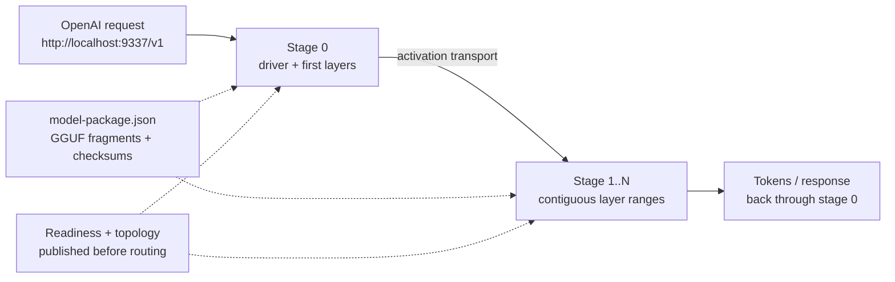

# Running Large Models

Start with one working node first. After console chat works, use additional machines or catalog layer packages for larger models.

If you are just trying Mesh for the first time, do not start here. Run the [Quickstart](/docs/pages/quickstart/) first.

## Add serving machines

Run the same private mesh name on each machine:

```sh
mesh-llm serve --discover my-private-mesh --model <model-ref>
```

Each serving node advertises its available models. Your local API stays:

```text
http://localhost:9337/v1
```

## Use a catalog model

Search for a model:

```sh
mesh-llm models search gemma
```

Serve a selected ref:

```sh
mesh-llm serve --discover my-private-mesh --model unsloth/gemma-4-26B-A4B-it-GGUF:UD-Q4_K_M
```

## Layer packages

Some catalog entries include layer packages. A layer package is a prepared artifact Mesh can use to place parts of a supported model across machines. You still send requests to one local endpoint.

Use layer packages when:

- the model is too large for one device
- the catalog marks a package as available
- the machines are on a low-latency network

## What a split does

Mesh keeps the public request path in one place while Skippy runs contiguous layer ranges on the machines that have the required package artifacts and capacity.



The [architecture hub](/docs/pages/architecture/) explains how Mesh routes requests into Skippy. See the [model package specification](/docs/pages/model-package-spec/) for the manifest schema, artifact checksums, and stage-selection rules. For package publishing and validation, see [Layer package repositories](https://github.com/Mesh-LLM/mesh-llm/blob/main/docs/LAYER_PACKAGE_REPOS.md).
